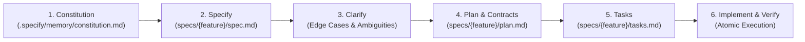

# GitHub Spec Kit (Spec-Driven Development) Skill

This skill enforces the official **GitHub Spec Kit (`github/spec-kit`)** methodology for Spec-Driven Development (SDD).

## Core Principles
1. **Specification is the Single Source of Truth (SSOT)**: Code follows the specification, not the other way around.
2. **Constitution First**: Project-level non-negotiables (e.g. DB-First SSOT, $0 cost guarantee, multilingual requirements) must be preserved across all tasks.
3. **De-risk with Clarification**: Surface ambiguities, edge cases, and performance bottlenecks *before* writing code.
4. **Contract-Driven Tasks**: All tasks must have testable Given-When-Then acceptance criteria.

---

## SDD Workflow Stages

### 1. `/speckit.constitution`
- Located at: `.specify/memory/constitution.md`
- Establishes project-wide architectural principles, quality standards, and constraints.

### 2. `/speckit.specify`
- Creates: `specs/<feature_name>/spec.md`
- Defines the **What** and **Why**: User stories, requirements, data flow, and constraints without prematurely locking implementation details.

### 3. `/speckit.clarify`
- Analyzes `spec.md` to identify missing details, rate limits, timeout risks, or ambiguities.
- Resolves questions *before* planning.

### 4. `/speckit.plan`
- Creates: `specs/<feature_name>/plan.md`
- Defines the technical architecture, component boundaries, and schema contracts.

### 5. `/speckit.tasks`
- Creates: `specs/<feature_name>/tasks.md`
- Breaks down the plan into ordered, atomic work items with clear dependency mapping.

### 6. `/speckit.implement`
- Executes tasks sequentially and verifies against acceptance criteria.
