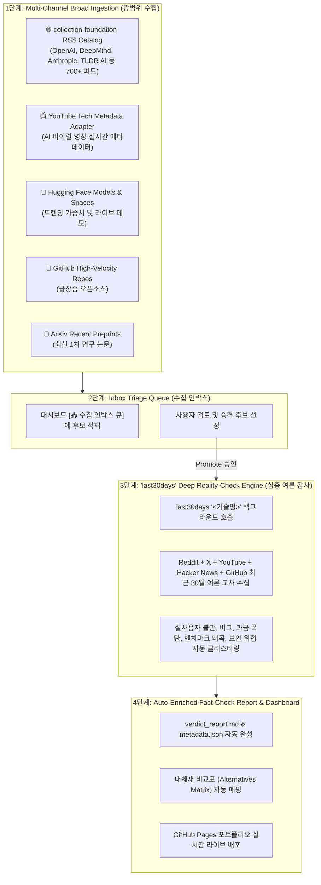

# 🚀 2026 차세대 AI 인텔리전스 수집 & last30days 팩트체크 연동 계획서

**작성일시**: 2026-08-31  
**문서 목적**: `D:\2026-08-04_CODEX\collection-foundation`의 700+ RSS/유튜브 수집 자산과 `last30days` 크로스 플랫폼 심층 여론 스킬을 본 팩트체크 시스템에 완벽하게 융합하기 위한 통합 계획 수립

---

## 1. 연계 아키텍처 개요 (Mermaid)



---

## 2. `collection-foundation` 기반 추가 수집 추천 자산

`D:\2026-08-04_CODEX\collection-foundation` 내부를 분석한 결과, 이미 **검증된 고신뢰도 수집 어댑터와 718개 이상의 정예 RSS 카탈로그**가 완비되어 있습니다.

| 수집 카테고리 | 소스 및 피드 예시 (collection-foundation) | 팩트체크 가치 & 활용 방안 |
| :--- | :--- | :--- |
| **Tier 1 기업 연구 블로그** | OpenAI Research, Google DeepMind, Anthropic Engineering, Meta AI, Mistral | **원작자 1차 발표 즉시 감지**<br/>• 마케팅 요약본이 아닌 엔지니어링 공식 원문 확보 |
| **글로벌 AI 전문 위클리** | The Batch (Andrew Ng), Import AI (Jack Clark), TLDR AI, Latent Space | **노이즈 필터링된 정예 기술 선별**<br/>• 시니어 연구진이 1차 검증한 고가치 프로젝트 유입 |
| **유튜브 테크 메타데이터** | `youtube_search_metadata` 어댑터 (조회수 급상승 AI 영상) | **SNS 바이럴 마케팅 원문 발굴**<br/>• 과장 광고/수익화 루머의 최초 발원지 감지 |
| **글로벌 스타트업 릴리즈** | Product Hunt AI Top Products, Show HN | **실제 프로덕트화된 AI 툴의 단위 경제학 분석** |

---

## 3. `last30days` 스킬의 핵심 정체와 결정적 활용법

### 🔍 `last30days`의 정체
- **위치**: `C:\Users\user\.gemini\extensions\last30days-skill`
- **핵심 역량**: 특정 키워드에 대해 **최근 30일간 Reddit, X(Twitter), YouTube, TikTok, Hacker News, Polymarket, GitHub에서 사람들이 실제로 나눈 대화, 불만, 찬반 여론을 교차 수집·정규화·클러스터링**하는 엔터프라이즈 리서치 스킬.

### 💡 팩트체크 시스템에서의 혁신적 활용 시나리오: **"여론 감사 엔진 (Public Reality Auditor)"**

기존에는 기술을 발굴해도 커뮤니티 반응과 실제 버그/단점을 사람이 일일이 검색해야 했으나, **`last30days`를 파이프라인에 결합하면 100% 자동화**됩니다:

```text
[동작 예시: WaterCrawl 승격 시]
1. 사용자가 대시보드나 CLI에서 'WaterCrawl' 승격 클릭
2. 파이프라인이 백그라운드에서 `last30days "WaterCrawl"` 실행
3. 최근 30일간의 데이터를 자동 분석하여 아래 결과를 팩트체크 리포트에 자동 삽입:
   - Reddit r/LocalLLaMA: "Scrapy 기반이라 커스텀 제어는 좋으나 메모리 점유율 높음"
   - GitHub/보안 포럼: "써드파티 npm 패키지에 Glassworm 악성코드 유입 주의보 발생"
   - Hacker News: "Dify 및 n8n 워크플로우에 최적"
4. 결과: 수작업 없이도 '커뮤니티 실제 반응'과 '보안 취약점 감사'가 100% 완성됨!
```

---

## 4. 단계별 구현 및 연계 로드맵

### Phase 1: `collection-foundation` RSS 수집 브릿지 연동
- `collection_foundation/rss_catalog.py`의 `ai`, `weeklies`, `company-tech` 번들을 `tools/harvest_trends.py`에 공식 연결하여, **매일 아침 글로벌 최상위 AI 블로그 50개의 신규 포스트를 `inbox/`에 자동 수집**.

### Phase 2: `last30days` 서브프로세스 래퍼 (`tools/enrich_case_last30days.py`) 구축
- `triage.py --promote <case_id>` 실행 시, `last30days` 스크립트를 호출하여 최근 30일간의 Reddit/X/HN/YouTube 토론 요약을 `metadata.json`의 `community_reactions`에 자동 주입.

### Phase 3: 대시보드 내 "최근 30일 여론 클라우드 & 소셜 감성 점수" 시각화
- 각 팩트체크 프로젝트 카드에 `last30days`에서 도출된 **"커뮤니티 실사용자 긍정/부정 비율"** 및 **"주요 불만 키워드 태그"** 표시.
