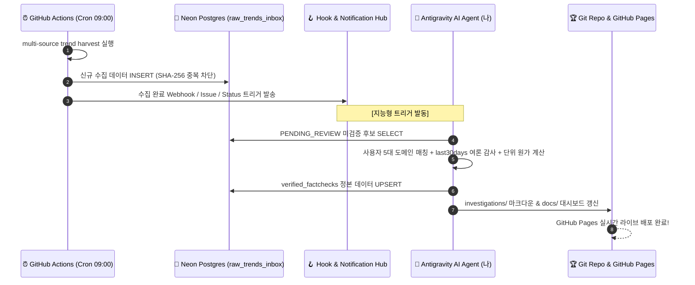

# 🪝 자율 AI 팩트체크 훅(Hook) & 트리거 파이프라인 설계서

**작성일시**: 2026-09-01  
**문서 목적**: GitHub Actions가 수집하여 Neon Postgres에 적재한 원본 트렌드 데이터를 **AI 에이전트(Antigravity)가 자율적으로 감지하고, 심층 분석(Tier 2 팩트체크)으로 승격시키는 훅(Hook) & 트리거 아키텍처** 정의

---

## 1. 훅(Hook) 아키텍처 3단계 흐름도 (Mermaid)



---

## 2. 권장하는 3가지 실무 훅(Hook) 연동 방식

### 방안 1: Session Startup Auto-Triage Hook (로컬 에이전트 자동 감지 - 강력 추천)
- **작동 원리**:
  - 사용자가 나와 작업을 시작할 때, 내가 `tools/db_bridge.py`를 통해 Neon DB를 스캔하여 **"오늘 새벽 GitHub Actions가 수집해 둔 신규 트렌드 중 사용자 맞춤 도메인 Top N개"**를 자동 브리핑.
- **예시 대화 흐름**:
  > *"사용자님, 오늘 새벽 GitHub Actions가 Neon DB에 32건의 최신 트렌드를 적재했습니다. 이 중 사용자님의 관심사인 'RAG 파서' 및 '비디오 자동화' 분야의 급상승 후보 2건이 감지되었습니다. 바로 `last30days` 여론 감사 및 팩트체크를 진행할까요?"*
- **장점**:
  - AI 에이전트의 모든 고성능 툴(웹 검색, 실측 계산, last30days, 마크다운/대시보드 빌드)을 풀 파워로 활용하여 최고 퀄리티의 팩트체크 보장.

---

### 방안 2: GitHub IssueOps Hook (GitHub 웹/모바일 원클릭 승인 훅)
- **작동 원리**:
  - GitHub Actions가 수집 후, 바이럴 점수 상위 후보를 GitHub Repository의 **Issue(이슈)**로 자동 생성:
    - 이슈 제목: `[Auto-Triage] Qwen3.8-Flash-Next (HF Trending 1위)`
    - 이슈 본문: 소스 링크, 바이럴 점수, 초기 메타데이터 포함.
  - 사용자가 스마트폰이나 브라우저에서 이슈에 `/factcheck` 또는 `승인` 댓글을 남기면 Webhook 트리거가 발동하여 팩트체크 자동 완료.

---

### 방안 3: Discord / Slack / Telegram Webhook Notification Hook
- **작동 원리**:
  - GitHub Actions 수집 완료 시 지정된 웹훅 URL(Discord/Slack 채널)로 요약 카드를 발송.
  - 클릭 한 번으로 대시보드 인박스 또는 GitHub 저장소로 이동하여 검토 가능.

---

## 3. 구현 단계 및 도구 (`tools/ai_agent_runner.py`)

AI 에이전트가 언제든 Neon DB의 최신 미검증 인박스를 쿼리하고 자동 팩트체크 초안을 합성할 수 있는 오케스트레이션 스크립트를 제공합니다:

```bash
# Neon DB에서 미검증 트렌드를 가져와 AI 분석 브리핑 생성
python tools/ai_agent_runner.py --triage-pending

# 특정 케이스를 last30days + 단위 원가와 함께 정본 DB로 승격
python tools/ai_agent_runner.py --auto-analyze <inbox_id>
```
