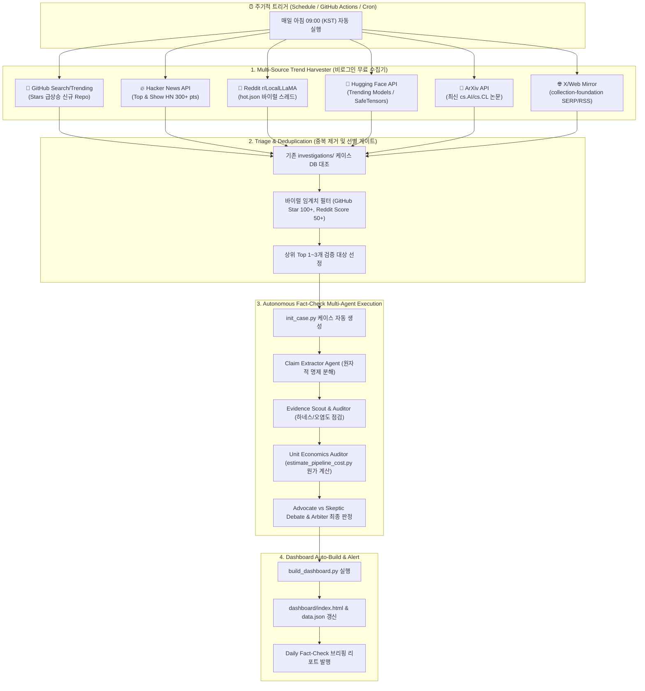

# 🤖 2026 완전 자동화 트렌드 수집 & 팩트체크 파이프라인 계획서

**작성일시**: 2026-08-31  
**문서 목적**: GitHub, Hacker News, Reddit, Hugging Face, X 등에서 트렌디한 최신 AI 기술을 **비로그인/무료 API로 주기적 자동 수집하고, 팩트체크 및 포트폴리오 대시보드 갱신까지 무인화(Autonomous Pipeline)하기 위한 아키텍처 및 구현 계획 수립**

---

## 1. 자동화 전체 아키텍처 개요 (Mermaid)

---

## 2. 채널별 비로그인 / 무료 수집 방식 타당성 분석 (Feasibility Matrix)

| 수집 채널 | 비로그인 지원 여부 | 권장 엔드포인트 / 수집 방식 | Rate Limit & 주의사항 | 신뢰도 / 가치 |
| :--- | :---: | :--- | :--- | :---: |
| **Hacker News** | **완전 무료 / 무제한** | `https://hacker-news.firebaseio.com/v0/topstories.json` | 제한 없음 (공식 Firebase REST API) | ⭐⭐⭐⭐⭐ (최상위 엔지니어 토론) |
| **Hugging Face** | **완전 무료 / 키 불필요** | `https://huggingface.co/api/models?sort=trendingScore&direction=-1&limit=20` | 공식 무료 REST API (초당 수십 회 가능) | ⭐⭐⭐⭐⭐ (신규 가중치/모델 원본) |
| **Reddit** | **비로그인 JSON 지원** | `https://www.reddit.com/r/LocalLLaMA/hot.json?limit=25` | Custom User-Agent 헤더 필수 (60 req/min) | ⭐⭐⭐⭐ (로컬 AI 루머/실사용 피드백) |
| **GitHub** | **비로그인 API 지원** | 1) `GET /search/repositories?q=created:>7일전+stars:>100&sort=stars` 2) GitHub Trending HTML 경량 파서 | 비로그인 10 req/min (PAT 토큰 등록 시 30 req/min) | ⭐⭐⭐⭐⭐ (코드/리포지토리 원본) |
| **ArXiv** | **완전 무료 / 키 불필요** | `http://export.arxiv.org/api/query?search_query=cat:cs.AI&sortBy=submittedDate` | 3초당 1회 (충분) | ⭐⭐⭐⭐⭐ (원저자 1차 논문) |
| **X (Twitter)** | 간접 수집 (미러/SERP) | `collection-foundation` SERP 브릿지 / Tidings RSS / Nitter API | 공식 X API 유료화($100/mo)에 따른 간접 수집 레인 활용 | ⭐⭐⭐ (바이럴 마케팅 원문) |

---

## 3. 세부 단계별 구현 설계 (Step-by-Step Implementation)

### Stage 1: 트렌드 하베스터 (`tools/harvest_trends.py`)
- Python 표준 라이브러리 `urllib` / `requests`로 동작.
- 매일 실행 시 5개 주요 채널(Hacker News, Hugging Face, Reddit, GitHub, ArXiv)에서 상위 인기 프로젝트 리스트를 수집하여 `staging/trends_YYYY-MM-DD.json`에 저장.

### Stage 2: 지능형 선별 게이트 (Triage Filter)
- 이미 `investigations/`에 등록된 저장소/이슈는 자동 스킵(Deduplication).
- **바이럴 점수(Viral Score) 계산식**:
  $$\text{Score} = (\text{GitHub Stars} \times 1.0) + (\text{HN Points} \times 2.0) + (\text{Reddit Upvotes} \times 1.5)$$
- 당일 바이럴 점수 상위 **1~2건을 '금일의 팩트체크 대상'으로 자동 선정**.

### Stage 3: 팩트체크 에이전트 자동 실행 (Agent Orchestration)
1. `init_case.py`를 호출하여 `investigations/YYYY-MM-DD_[repo|sns]_[name]/` 생성.
2. `Claim Extractor`가 README/원문에서 명제 3건 추출.
3. `Evidence Scout`가 ArXiv/LiveBench/Safetensors 헤더 대조.
4. `estimate_pipeline_cost.py`로 1편당/월간 단위 원가 자동 계산.
5. `Arbiter`가 최종 판정 뱃지 부여 및 `metadata.json` 작성 (기본 상태: `PENDING_RESEARCH`).

### Stage 4: 대시보드 자동 빌드 및 배포
- `tools/build_dashboard.py`가 실행되어 `dashboard/index.html`을 갱신.
- (옵션) GitHub Actions 설정 시 GitHub Pages에 자동 배포되어 전 세계 어디서나 실시간 포트폴리오 열람 가능.

---

## 4. 운영 방식 및 인프라 옵션

### 옵션 A: 로컬 무인화 (Windows Task Scheduler / Python Schedule)
- 내 로컬 PC에서 백그라운드로 매일 아침 09:00에 스크립트 1회 가동.
- 장점: 로컬 GPU/환경에서 가중치 실측 연동 가능, 비용 $0.

### 옵션 B: GitHub Actions 클라우드 무인화 (권장)
- `.github/workflows/daily_factcheck.yml` 등록.
- 매일 GitHub 서버에서 무료(Ubuntu runner)로 트렌드 수집 -> 팩트체크 리포트 커밋 -> GitHub Pages 대시보드 자동 배포.
- 장점: PC가 꺼져 있어도 24/365 자동으로 포트폴리오가 누적됨 (취업용 깃허브 잔디/기여도 자동 생성).

---

## 5. 단계별 구현 로드맵 (Roadmap)

1. **Phase 1 (데이터 수집기 구축)**: `tools/harvest_trends.py` (HN, HF, Reddit, GitHub 비로그인 수집 스크립트).
2. **Phase 2 (트리아지 및 에이전트 연동)**: 수집된 트렌드 중 Top 1건을 `init_case.py`로 연결하여 마크다운 초안 생성.
3. **Phase 3 (GitHub Actions 배포)**: 매일 자동 실행 워크플로우 연동.
