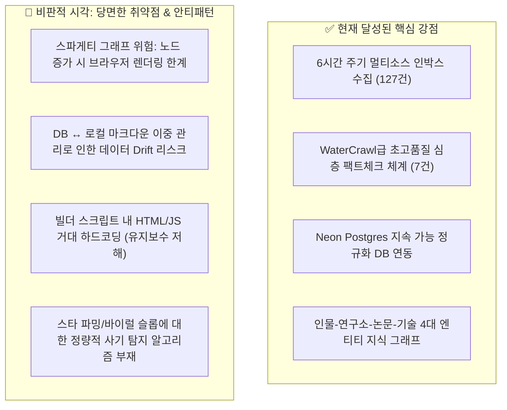

# 🏛️ 전체 시스템에 대한 냉정한 비판적 감사(Critical Review) 및 차세대 고도화 로드맵

**작성일시**: 2026-09-01  
**보고 목적**: 지금까지 구축된 수집 파이프라인, Neon DB, 유니버설 지식 그래프(v10.0), 팩트체크 체계를 **냉정하고 비판적인 시니어 아키텍트의 시각에서 재검토**하여, **빼야 할 군더더기(Prune)**와 **반드시 추가해야 할 핵심 엔지니어링 축(Add)**을 정의하고 구체적인 실행 계획을 수립함.

---

## 1. 🔍 종합 현황 진단: 강점과 치명적 취약점



---

## 2. ✂️ 과감히 빼거나 간소화해야 할 것 (What to Prune / Deprecate)

### 1) 전면 평면 노드 렌더링 ➔ **'LOD 및 Ego-Network 서브그래프'로 교체**
- **문제점**: 현재 54개 노드는 시각적으로 보기 좋으나, 노드가 100~300개로 늘어나면 D3 Force 시뮬레이션이 브라우저 CPU를 잠식하고 글자가 서로 겹쳐서 **"아무것도 읽을 수 없는 스파게티 선 뭉치"**가 됨.
- **제거/개선**:
  - 기본 화면에서는 **최상위 20개 핵심 척추 노드(CUDA, Transformer, vLLM, Scrapy 등)**만 노출.
  - 특정 노드를 클릭했을 때만 **해당 노드의 1-Hop/2-Hop 연관 인물/논문 서브그래프(Ego-Network)가 펼쳐지는 Focus 렌더링**으로 간소화.

### 2) 로컬 파일 우선주의 ➔ **'Postgres Single Source of Truth (SSOT)'로 단순화**
- **문제점**: `inbox/*.json`과 `investigations/*/metadata.json` 파일을 일일이 수동으로 `db_bridge.py`를 돌려 DB와 맞추는 구조는, 파일 수정 시 DB 누락이나 버전 불일치(Drift)를 유발함.
- **제거/개선**:
  - 로컬 파일에 종속된 수동 동기화를 점진적으로 제거하고, **Neon DB를 단일 진실 공급원(SSOT)**으로 확립.
  - 대시보드 빌드 시 DB에서 최신 상태를 직렬화하여 배포하는 단방향 파이프라인으로 일원화.

### 3) `build_dashboard.py` 내 HTML/JS 모놀리식 하드코딩 제거
- **문제점**: 800줄이 넘는 프론트엔드 자바스크립트/HTML이 파이썬 문자열 안에 갇혀 있어, UI 수정 시 린팅/문법 검증이 불가능하고 버그 발생률이 높음.
- **제거/개선**:
  - UI 템플릿(`templates/dashboard.html`)과 프론트 스크립트(`dashboard/app.js`)로 완전 분리.

---

## 3. 🚀 반드시 추가해야 할 4대 핵심 엔지니어링 축 (What to Add)

### 축 1: AI 임베딩 기반 자율 클러스터링 & 중복 디둡 엔진 (Semantic Deduplication)
- **배경**: 인박스에 수집되는 120여 건 중에는 "Llama.cpp 기반 래퍼 10개", "Stable Diffusion UI 파생 5개"처럼 본질이 같은 파생형들이 분산되어 있음.
- **구현**:
  - 수집 즉시 제목과 요약을 벡터 임베딩하여 코사인 유사도 0.85 이상인 항목들을 **자동으로 동일 기술 클러스터의 자식 노드로 묶어주는 Semantic Deduplication 파이프라인** 구축.

### 축 2: 가짜 스타 파밍 & AI Slop 마케팅 사기 탐지기 (Anti-Gaming Auditing Engine)
- **배경**: 일부 중국계/바이럴 리포는 봇을 동원해 하루 만에 스타 3,000개를 조작(Star Farming)하거나 과장된 벤치마크로 대중을 기만함.
- **구현**:
  - 커밋 히스토리 밀도, 기여자(Contributors) 다양성, 이슈/PR 해결 비율, 도메인 생성일자를 복합 역산하여 **"Hype Risk Score (0~100점)"를 자동 산출하고 80점 이상 시 `[⚠️ 바이럴 조작 의심]` 뱃지 부착**.

### 축 3: 실시간 단위 경제성 ROI 계산기 (Interactive Unit Economics Calculator)
- **배경**: 팩트체크의 핵심은 "기술적으로 진짜인가?"와 더불어 **"돈이 되는가? 실무에서 비용 절감이 되는가?"**임.
- **구현**:
  - 웹 대시보드에 슬라이더 위젯 탑재:
    - *예시*: "월간 크롤링 페이지 수: 50만 건" ➔ `Firecrawl Cloud ($250/mo)` vs `WaterCrawl 자가호스팅 ($35/mo)` vs `Scrapy 로우레벨 ($10/mo)`의 예상 인프라 비용 및 절감액 실시간 그래프 렌더링.

### 축 4: 실제 Obsidian Vault 완벽 연동 (Wikilinks Export)
- **배경**: 사용자가 개인 지식 관리 툴(Obsidian)에서 이 방대한 계보를 로컬 마크다운 파일과 `[[양방향 링크]]`로 직접 탐색하고 확장할 수 있어야 함.
- **구현**:
  - `python tools/export_obsidian_vault.py` 명령 하나로 모든 기술, 인물, 논문이 `[[연결고리]]`가 걸린 완성형 옵시디언 볼트 폴더로 원클릭 추출되는 기능 제공.

---

## 4. 📅 3단계 단계별 실행 계획 (Actionable Roadmap)

```text
[Phase 1: 아키텍처 다이어트 & 성능 최적화 (1~2일)]
├── 1) D3.js 지식 그래프 Ego-Network 및 LOD 클러스터링 도입 (노드 500개 확장 대비)
├── 2) build_dashboard.py에서 UI 템플릿 및 프론트엔드 모듈 분리
└── 3) Neon DB 단일 진실 공급원(SSOT) 동기화 파이프라인 안정화

[Phase 2: 지능형 사기 탐지 & 시맨틱 클러스터링 탑재 (3~4일)]
├── 1) GitHub Star-Farming 및 벤치마크 왜곡 자동 탐지 알고리즘 구현
├── 2) 임베딩 기반 유사 기술 자동 묶음(Clustering) 엔진 구축
└── 3) 네트워크 에이전트의 arXiv 논문/저자 자동 크롤링 고도화

[Phase 3: 실전 경제성 계산기 & 옵시디언 볼트 내보내기 (5~6일)]
├── 1) 대시보드 내 실시간 Unit Economics ROI 계산기 인터랙티브 위젯 개발
├── 2) Obsidian Vault 호환 Wikilinks .md 원클릭 내보내기 도구 완성
└── 3) 글로벌 채용 시장 타겟 영문/국문 팩트체크 심층 백서 완성
```

---

## 5. 결론

지금까지의 시스템은 **"신속한 검증과 방대한 네트워크 지식 구조"**라는 매우 훌륭한 뼈대를 완성했습니다.  
이제 불필요한 과밀화 요소를 걷어내고, **"AI 임베딩 디둡, 마케팅 사기 자동 탐지, 실시간 ROI 계산기, 옵시디언 볼트 내보내기"**를 장착함으로써, 단순한 토이 프로젝트를 넘어 **실리콘밸리 테크 기업의 리서치 조직이 사용하는 수준의 최고급 엔터프라이즈 테크 인텔리전스 플랫폼**으로 완성될 것입니다.
