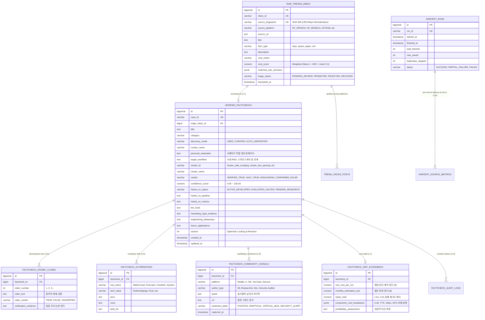

# 🏛️ 지속 가능한 2계층 AI 팩트체크 데이터베이스 스키마 설계서 (Sustainability & Scale Architecture)

**설계 기준일**: 2026-09-01  
**데이터베이스 엔진**: Neon Serverless Postgres (PostgreSQL 16+)  
**핵심 설계 철학**: **SUSTAINABILITY (지속 가능성)** — 수개월/수년간 매일 수백 건의 트렌드가 누적되어도 성능 저하 없이 시계열 감사, 중복 차단, 버전 이력 추적, 정량 단위 경제학을 담아내는 확장형 아키텍처

---

## 1. ERD 아키텍처 다이어그램 (Mermaid)

---

## 2. 지속 가능성을 위한 5대 핵심 설계 원칙

### 원칙 1: 불변성(Immutability)과 크로스 플랫폼 지문(Fingerprint) 중복 차단
- `source_fingerprint`: 동일한 깃허브 저장소(예: `watercrawl/WaterCrawl`)가 Hugging Face, Hacker News, X에서 동시에 바이럴되어도 **정규화된 SHA-256 지문**으로 완벽하게 식별.
- `TREND_CROSS_POSTS` 테이블을 통해 한 기술이 "어느 플랫폼들에서 연속으로 바이럴되었는지" 소셜 확산 시계열 궤적을 추적.

### 원칙 2: 1:N 정규화로 환각(Hallucination) 원천 배제
- 기존의 비정형 거대 JSON을 탈피하여:
  - **`FACTCHECK_ATOMIC_CLAIMS`**: 명제별 검증 결과 분리.
  - **`FACTCHECK_ALTERNATIVES`**: 대체재 기술 스택 및 장단점 구조화.
  - **`FACTCHECK_COMMUNITY_SIGNALS`**: `last30days`가 수집한 플랫폼별 실제 여론과 보안 경보(Security Alert) 정밀 격리.

### 원칙 3: 단위 경제학(Unit Economics) 수치 정밀화
- 단순 텍스트 평가가 아닌, **`FACTCHECK_UNIT_ECONOMICS`**에 건당 단가, 월간 예상 원가, 리젝트 비율(Reject Ratio)을 수치화(`NUMERIC`)하여, 향후 SQL 쿼리로 "가장 가성비 좋은 AI 툴 TOP 10" 같은 데이터 인사이트 도출 가능.

### 원칙 4: 감사 이력 및 버전 관리 (Audit Logs)
- AI 에이전트 또는 사용자가 판정을 수정할 때마다 `FACTCHECK_AUDIT_LOGS`에 변경 전/후 값과 수정 사유(Changed Reason)를 기록하여 투명성 보장.

### 원칙 5: 고성능 인덱싱 전략 (Indexing & GIN Search)
- `B-Tree 인덱스`: `triage_status`, `cluster_id`, `harvested_date`, `case_id`
- `GIN 인덱스`: `matched_user_domains` (사용자 맞춤 도메인 초고속 필터링), `raw_payload`
