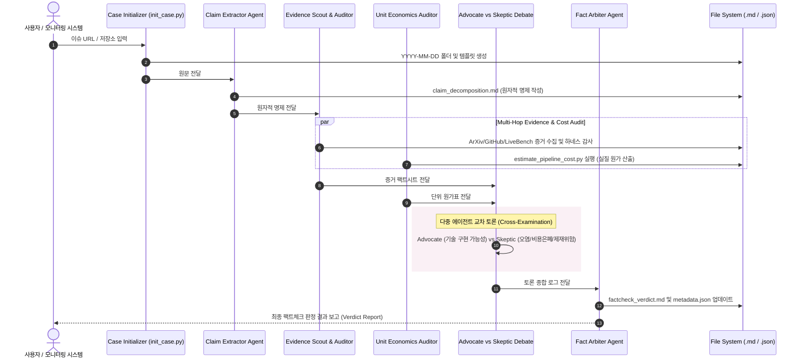

# 🌐 2026 SOTA Web & SNS 최신 기술 Fact-Check 전체 파이프라인 아키텍처

본 문서는 본 시스템에서 가동 중인 **5단계 멀티 에이전트 팩트체크 파이프라인(Pipeline)**과 각 단계별 **투입 에이전트(Agent)**, **장착 스킬/도구(Skills & Tools)**, **입출력 아티팩트(Artifacts)**를 종합 도식화한 아키텍처 명세서입니다.

---

## 1. 엔드투엔드(End-to-End) 파이프라인 아키텍처 다이어그램 (Mermaid)

```mermaid
flowchart TD
    subgraph INGRESS["0. Ingress & Case Initialization (유입 및 케이스 초기화)"]
        A1["SNS Viral 포스트 (X, Reddit, Threads)"]
        A2["GitHub 저장소 / 신규 모델 (Release/PR)"]
        A3["CLI Initializer (tools/init_case.py)"]
        A1 & A2 --> A3
        A3 --> A4["investigations/YYYY-MM-DD_[sns|repo]_[name]/ 폴더 생성<br/>- raw_sources.md / claim_analysis.md<br/>- metadata.json"]
    end

    subgraph STEP1["1단계: Claim Decomposition (주장의 원자화)"]
        B1["🤖 Claim Extractor Agent<br/>(감정/마케팅 노이즈 제거)"]
        A4 --> B1
        B1 --> B2["검증 가능한 원자적 명제 (Atomic Claims)<br/>- Claim 1: 성능/벤치마크 점수<br/>- Claim 2: 하드웨어/VRAM/효율성<br/>- Claim 3: 오픈소스 라이선스<br/>- Claim 4: 비용/수익화 가능 여부"]
    end

    subgraph STEP2["2단계: Multi-Hop Evidence & Contamination Audit (증거 수집 및 오염 감사)"]
        C1["🤖 Evidence Scout & Benchmark Auditor"]
        B2 --> C1
        
        subgraph SOURCES["Tier 1 ~ Tier 4 Source Matrix"]
            S1["Tier 1: GitHub Commits / ArXiv 논문 / LiveBench / HF Safetensors"]
            S2["Tier 2: SemiAnalysis / Epoch AI / 공식 벤더 기술 블로그"]
            S3["Tier 3: Reddit r/LocalLLaMA / 커뮤니티 재현 스레드"]
            S4["로컬 백업 브릿지: D:\\2026-08-04_CODEX\\collection-foundation"]
        end
        C1 <--> SOURCES
        C1 --> C2["수집된 증거 묶음 및 하네스/오염도(T1~T4) 감사 결과<br/>- Pass@1 vs Pass@k 왜곡 검사<br/>- 테스트셋 사전학습 유출 검사"]
    end

    subgraph STEP3["3단계: Unit Economics & Compute Audit (단위 경제학 및 실질 원가 산출)"]
        D1["🤖 Unit Economics Auditor<br/>(tools/estimate_pipeline_cost.py)"]
        C2 --> D1
        D1 --> D2["1편당 실질 제작 원가 및 월간 양산 비용 산출<br/>- LLM + TTS + Video Gen (Higgsfield Seedance 2.0 / Kling / Pexels)<br/>- Reject Ratio Multiplier (1.5x 실패 재시도 반영)"]
    end

    subgraph STEP4["4단계: Multi-Agent Cross-Examination (다중 에이전트 교차 토론)"]
        E1["🤖 Advocate Agent<br/>(기술적 구현 가능성 및 지지 논거)"]
        E2["🤖 Skeptic Critic Agent<br/>(체리피킹, 오염, 비용 은폐, 제재 리스크 공격)"]
        D2 --> E1 & E2
        E1 & E2 --> E3["교차 토론 및 논점 대조 (Cross-Examination Debate)"]
    end

    subgraph STEP5["5단계: Verdict Synthesis & Reporting (최종 판정 및 리포트 발행)"]
        F1["🤖 Fact Arbiter / Synthesizer Agent<br/>(configs/source_credibility_matrix.json 적용)"]
        E3 --> F1
        F1 --> F2["📢 최종 팩트체크 판정서 발행<br/>(factcheck_verdict.md / verdict_report.md)"]
        
        subgraph VERDICTS["6단계 표준 판정 척도"]
            V1["[ VERIFIED TRUE ]"]
            V2["[ MOSTLY TRUE ]"]
            V3["[ HALF TRUE / CONTEXT REQUIRED ]"]
            V4["[ MISLEADING / GAMED ]"]
            V5["[ CONFIRMED FALSE ]"]
            V6["[ UNVERIFIABLE ]"]
        end
        F2 -.-> VERDICTS
    end

    style INGRESS fill:#f8f9fa,stroke:#6c757d,stroke-width:2px;
    style STEP1 fill:#e3f2fd,stroke:#1976d2,stroke-width:2px;
    style STEP2 fill:#e8f5e9,stroke:#388e3c,stroke-width:2px;
    style STEP3 fill:#fff3e0,stroke:#f57c00,stroke-width:2px;
    style STEP4 fill:#fce4ec,stroke:#c2185b,stroke-width:2px;
    style STEP5 fill:#ede7f6,stroke:#512da8,stroke-width:2px;
```

---

## 2. 에이전트(Agent) & 장착 스킬(Skills) 상세 매트릭스

| 에이전트 명칭 (Agent Role) | 주임무 (Primary Responsibilities) | 장착 스킬 및 도구 (Skills & Tools) | 입력 (Input) | 출력 산출물 (Output) |
| :--- | :--- | :--- | :--- | :--- |
| **1. Case Initializer** | 새 기술 이슈/SNS 루머 유입 시 날짜별 표준 디렉토리와 템플릿 자동 세팅 | • `tools/init_case.py` • `run_command` • `write_to_file` | 이슈명, URL, 타겟 Repo | `investigations/YYYY-MM-DD_*` 기본 골격 및 `metadata.json` |
| **2. Claim Extractor** | 바이럴 텍스트에서 감정/마케팅 노이즈를 걷어내고 원자적 사실 명제 추출 | • `read_url_content` • Text Decomposition Rules • Fast Reasoning LLM | SNS 원문, 기사, Repo README | `claim_decomposition.md` (원자적 명제 1, 2, 3...) |
| **3. Evidence Scout & Benchmark Auditor** | Tier 1~4 소스 및 논문, 가중치 헤더, 벤치마크 하네스 감사 (오염도 T1~T4 점검) | • `search_web` • `literature-search-arxiv` • `view_file` / `grep_search` • `collection-foundation` 로컬 브릿지 | 원자적 명제 목록 | 1차 증거 팩트시트, 하네스 조작 여부, 소스 등급 매핑 |
| **4. Unit Economics Auditor** | 1편당 표기 원가, 재시도 배율(1.5x) 반영 실질 원가, 월간 양산 비용 산출 | • `tools/estimate_pipeline_cost.py` • `configs/pipeline_cost_benchmark.json` • 수치 연산 엔진 | 파이프라인 컴포넌트 (LLM, TTS, Video Gen) | 1편/월간 단위 원가표, ROI 및 플랫폼 채산성 분석 |
| **5. Advocate Agent** | 공개된 코드, 논문 수치, 무료 조합 가능성 등 해당 주장의 기술적 근거 제시 | • Code Tracing (`view_file`) • GitHub Repo Explorer | 1차 증거 및 원가표 | 지지 논거 (Pro-arguments) |
| **6. Skeptic Critic Agent** | 데이터 오염, 평가 하네스 변조, 체리피킹, 비용 은폐, 플랫폼 제재 위험 집중 공격 | • Adversarial Prompting • Community Issue Scanner (`search_web`) • Platform Policy Checker | 1차 증거, 지지 논거 | 비판적 반론 (Critique & Risk Flags) |
| **7. Fact Arbiter (Synthesizer)** | 신뢰도 매트릭스를 적용하여 논쟁을 중재하고 최종 6단계 판정서 발행 | • `configs/source_credibility_matrix.json` • Executive Summary Synthesizer | 교차 토론 전체 내역 | `factcheck_verdict.md` `verdict_report.md` |

---

## 3. 세부 워크플로우별 상호작용 및 데이터 흐름

---

## 4. 실전 검증 완료 케이스 레퍼런스

현재 위 파이프라인을 통과하여 완벽히 검증 및 아카이빙된 케이스 목록입니다:

1. **[Firecrawl AnyDoc 기술 감사]**
   - 경로: [investigations/2026-08-31_repo_firecrawl_anydoc/](file:///d:/2026.06.21_Antigravity/2026-08-31_WEB_Factcheck/investigations/2026-08-31_repo_firecrawl_anydoc/)
   - 판정: `[ VERIFIED TRUE ]` (4.4ms 속도, 14종 포맷, $0 로컬 무결성 입증)
2. **[MoneyPrinterTurbo & Higgsfield Seedance 2.0 원가 검증]**
   - 경로: [investigations/2026-08-31_sns_angeldot_moneyprinterturbo_claim/](file:///d:/2026.06.21_Antigravity/2026-08-31_WEB_Factcheck/investigations/2026-08-31_sns_angeldot_moneyprinterturbo_claim/)
   - 판정: `[ HALF TRUE / CONTEXT REQUIRED ]` (기능은 사실이나, 순수 AI 1분 영상 제작 시 편당 $20/월 $600 실질 비용 발생)
3. **[DeepSeek 추론 모델 벤치마크 및 VRAM 루머 검증]**
   - 경로: [investigations/2026-08-31_sns_sample_deepseek_reasoning_claim/](file:///d:/2026.06.21_Antigravity/2026-08-31_WEB_Factcheck/investigations/2026-08-31_sns_sample_deepseek_reasoning_claim/)
   - 판정: `[ MISLEADING / GAMED ]` (Pass@64 다수결과 Pass@1 왜곡 비교, 671B 풀모델 단일 4090 구동 불가)
