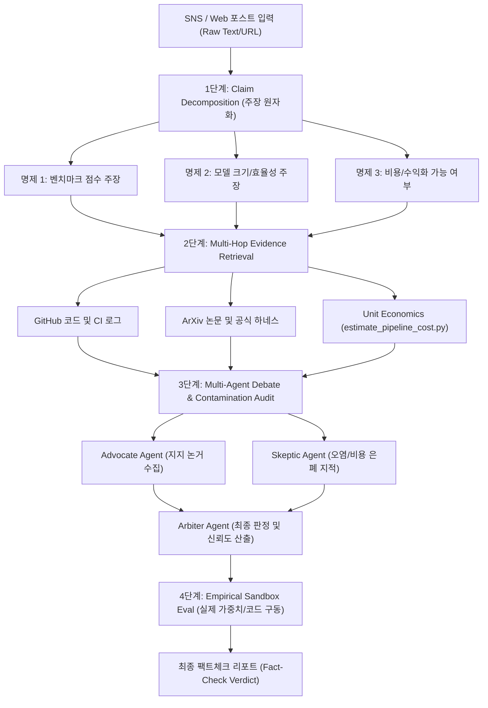

# 2026 SOTA 웹/SNS 최신 기술 Fact-Check & 모델 검증 심층 보고서

**작성일시**: 2026-08-31 (v2.0 파이프라인 단위 경제학 추가)  
**대상**: WEB / SNS 유입 최신 AI 기술 및 모델 주장의 신뢰성 팩트체크 시스템  
**문서 목적**: 2026년 최신 기술 동향(SOTA)을 반영한 정보원 신뢰도 계층화, 단일 모델 검증 방법론, 파이프라인 단위 경제학(Unit Economics) 원가 감사, 최적 에이전트 및 스킬 구성 가이드 수립

---

## 1. 개요 및 배경

2025~2026년에 이르러 AI 및 최신 IT 기술 분야에서는 **"리더보드 인플레이션"**과 **"SNS 중심의 하이프(Hype) 마케팅"**이 극에 달했습니다. 
정적 벤치마크(MMLU, GSM8K 등)는 대부분의 프론티어 및 오픈소스 모델에서 포화(Saturation)되었고, **학습 데이터 오염(Data Contamination)**으로 인해 벤치마크 점수가 6%~40%까지 부풀려지는 현상이 확인되었습니다.

SNS(X/Twitter, Reddit, Threads, YouTube)에서는 다음과 같은 형태의 왜곡된 주장이 실시간으로 확산됩니다:
1. **체리피킹된 벤치마크 / 프롬프트 하네스 조작**: 특정 유리한 프롬프트(Few-shot 기법, 비표준 시스템 프롬프트 등)를 사용하여 점수를 인위적으로 높인 결과 공유.
2. **"Open Source" 라벨링의 왜곡**: 가중치만 공개(Open Weights)되었거나 상업적 이용이 금지된 라이선스임에도 "완전 오픈소스"로 둔갑.
3. **스펙 축소/양자화 성능 과장**: 7B/8B 소형 모델이 GPT-4o나 Claude 3.5 Sonnet을 전면 능가한다는 식의 무리한 일반화.
4. **"완전 무료 / 돈 복사기" 마케팅 (비용 은폐)**: 오픈소스 툴이라며 홍보하지만 실제 상용 수준의 결과물을 얻기 위해 막대한 유료 API 비용(Higgsfield Seedance, Runway, ElevenLabs 등)이 발생함을 은폐.

따라서 본 시스템은 **"정보의 원자화(Claim Decomposition) -> 다각적 증거 수집(Multi-hop Retrieval) -> 파이프라인 단위 경제학 감사(Unit Economics Audit) -> 다중 에이전트 교차 토론(Multi-Agent Debate) -> 샌드박스 실증 재현(Empirical Sandbox Eval)"**의 5단계 팩트체크 파이프라인을 운영합니다.

---

## 2. 2026 SOTA 정보원 신뢰도 매트릭스 (Source Credibility Matrix)

증거를 평가할 때 정보원의 출처에 따라 가중치(Credibility Weight)를 부여합니다.

| 티어 (Tier) | 정보원 유형 | 대표 출처 예시 | 신뢰도 가중치 | 검증 시 고려사항 |
| :--- | :--- | :--- | :---: | :--- |
| **Tier 1 (Ground Truth / Primary)** | **실행 코드 및 가중치 원본** | GitHub/GitLab Official Repos, Hugging Face Hub (Verified Organization), SafeTensors SHA256 체크섬 | **0.95 ~ 1.0** | 커밋 이력, 이슈 트래커, CI/CD 재현성, 라이선스 파일 직접 확인 |
| **Tier 1 (Ground Truth / Primary)** | **동적/오염 방지 벤치마크** | `LiveBench`, `SWE-bench Verified`, `Humanity's Last Exam (HLE)`, `GPQA Diamond`, `LMSYS Chatbot Arena` (Blind A/B) | **0.90 ~ 0.95** | 평가 하네스(Harness) 일관성, 블라인드 투표 조작 방지 여부 확인 |
| **Tier 1 (Ground Truth / Primary)** | **원저자 동료평가 논문/프리프린트** | ArXiv (원저자 공식 소속 인증), NeurIPS, ICLR, ICML, ACL, Nature/Science | **0.85 ~ 0.90** | 수식의 무결성, 베이스라인 비교의 공정성, 데이터셋 구축 방식 |
| **Tier 2 (Verified Secondary)** | **독립 기술 연구소/서드파티 엔지니어링 랩** | SemiAnalysis, Epoch AI, Phind, LMSYS 분석 리포트, Weights & Biases Reports | **0.75 ~ 0.85** | 상업적 이해관계(Sponsorship) 유무 확인 |
| **Tier 2 (Verified Secondary)** | **공식 벤더 기술 블로그 및 릴리즈** | OpenAI, Anthropic, Google DeepMind, Meta AI, Mistral AI 공식 블로그 | **0.70 ~ 0.80** | 마케팅적 과장 수식어 제거 후 "실제 제공 기능/수치"만 추출 |
| **Tier 3 (Informational / Unverified)** | **개발자 커뮤니티 심층 스레드** | Reddit (`r/LocalLLaMA`, `r/MachineLearning`), Hacker News | **0.40 ~ 0.60** | 다수 사용자의 일관된 재현 실패/성공 피드백 통계로 활용 |
| **Tier 4 (High Noise / Fact-Check 대상)** | **SNS / 인플루언서 / 테크 미디어** | X (Twitter), Threads, YouTube Shorts, 자극적 Tech 뉴스 기사 | **0.10 ~ 0.30** | **검증의 '대상(Input Claim)'**으로만 사용하며, 증거(Evidence)로는 절대 사용하지 않음 |

---

## 3. '단일 파이프라인 전체' 원가 감사 (Unit Economics Audit)

2026년 AI 툴 팩트체크에서 **"비용(Cost)"**은 진위 여부를 가르는 핵심 기준입니다. "무료 오픈소스 툴로 숏폼 채널을 자동화하여 돈을 번다"는 주장을 검증할 때, **실제 파이프라인 전체를 구동하기 위한 엔드투엔드(End-to-End) 원가**를 산출합니다.

### 3.1. 1분(60초) 영상 기준 2026 단위 원가 벤치마크

| 컴포넌트 | 제공자 및 모델 | 1회/1분 기준 표기 원가 | Reject Ratio(1.5x) 반영 실질 원가 | 특성 및 팩트체크 포인트 |
| :--- | :--- | :---: | :---: | :--- |
| **대본 (LLM)** | OpenAI GPT-4o | $0.005 | $0.005 | 고품질 대본 생성 |
| **대본 (LLM)** | DeepSeek V3 | $0.0002 | $0.0002 | 초저가 대본 생성 |
| **음성 (TTS)** | Edge-TTS (무료) | $0.00 | $0.00 | 기계음 티가 남 (수익화 제재 위험) |
| **음성 (TTS)** | ElevenLabs Turbo v2 | $0.12 | $0.12 | 초고음질 자연스러운 목소리 |
| **비디오 (Stock)**| Pexels/Pixabay 무료 API | $0.00 | $0.00 | 수천 개 채널 중복으로 알고리즘 섀도우밴 위험 |
| **비디오 (Gen-AI)**| **Higgsfield Seedance 2.0 (720p)** | **$13.20** | **$19.80** | **5초당 22크레딧, 12개 클립 필요 (독창성 100%)** |
| **비디오 (Gen-AI)**| **Higgsfield Seedance 2.0 (1080p)**| **$27.00** | **$40.50** | **5초당 45크레딧, 최고화질 상업용** |
| **비디오 (Gen-AI)**| Kling 1.5 Pro (1080p) | $21.00 | $29.40 | 고화질 비디오 생성 |
| **비디오 (Gen-AI)**| Runway Gen-3 Turbo | $15.00 | $21.00 | 고속 생성 |

### 3.2. Reject Ratio (재시도율)의 중요성
AI 비디오 생성 모델은 손가락 왜곡, 물리법칙 오류, 카메라 무빙 결함 등으로 인해 **1번에 완벽한 컷이 나올 확률이 50~70% 수준**입니다. 따라서 실무 제작 원가 계산 시 **1.4x ~ 1.5x의 Reject Multiplier**를 반드시 곱해야 실제 월간 지출액이 정확히 예측됩니다.

---

## 4. '단일 모델' 검증 방법론 (Verification Methodology)



---

## 5. 최적의 AGENT 및 SKILL 구성 (Architecture & Efficiency)

| 에이전트 명칭 | 역할 및 책임 | 권장 모델 / 프롬프트 전략 | 필수 장착 SKILL |
| :--- | :--- | :--- | :--- |
| **Claim Extractor** | SNS 텍스트, 이미지, 링크에서 핵심 주장을 원자 단위로 파싱 | 고속 추론 모델 | `read_url_content`, Text Parser |
| **Evidence Scout** | GitHub, ArXiv, Hugging Face, LiveBench에서 원시 데이터 수집 | 리서치 특화 모델 | `search_web`, `view_file`, `literature-search-*` |
| **Unit Economics Auditor**| 파이프라인 전체의 1회/1분/월간 실질 API 제작 원가 산출 | 수치 계산 특화 | `run_command` (`estimate_pipeline_cost.py`) |
| **Skeptic Critic** | 오염도, 하네스 조작, 체리피킹, 비용 은폐 공격 및 반론 제기 | 비판적 사고 모델 | `search_web` (Reddit/Issues), Cost Auditor |
| **Fact Arbiter** | 모든 증거, 토론, 원가 분석을 종합하여 표준 팩트체크 판정서 발행 | 종합 판단 모델 | Markdown Artifact Tool |

---

## 6. 팩트체크 6단계 표준 판정 척도

```
[VERIFIED TRUE]         -> Tier 1 소스 및 독립 재현을 통해 명백히 입증됨
[MOSTLY TRUE]           -> 핵심 주장은 사실이나, 일부 사소한 조건(특정 하드웨어 환경 등)이 생략됨
[HALF TRUE / CONTEXT]   -> 수치는 사실이나 평가 하네스(Pass@k 등)나 숨겨진 유료 API 비용이 존재
[MISLEADING / GAMED]    -> 데이터 오염(Contamination) 또는 비표준 평가로 의도적으로 부풀려진 점수
[CONFIRMED FALSE]       -> 허위 정보이거나 제3자 독립 재현에서 완전히 실패함
[UNVERIFIABLE]          -> 가중치/코드/논문 미공개(Paperware/Vaporware) 상태로 현재 검증 불가
```