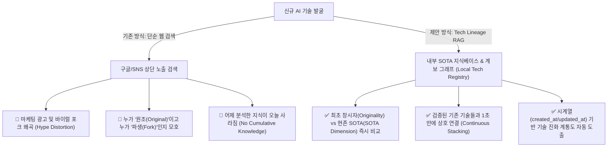

# 🏛️ AI 기술 계보학(Tech Lineage) 및 로컬 SOTA 지식 RAG 아키텍처 보고서

**작성일시**: 2026-09-01  
**보고 주제**: 매번 일회성 웹 검색에 의존하는 한계를 극복하고, **내부 누적형 기술 지식베이스(RAG), 독창성(Originality), SOTA 판별 기준, 시계열 메트릭(created_at/updated_at)**을 체계화하는 차세대 인텔리전스 설계

---

## 1. 문제의식: 왜 '단순 웹 검색'만으로는 유사기술 비교에 한계가 있는가?



### 1) 마케팅 Hype에 의한 원조(Originality) 왜곡
- 스타트업들이 원조 오픈소스를 살짝 래핑(Thin Wrapper)하여 화려한 마케팅으로 스타(Stars)를 뻥튀기하는 경우가 빈번하여, 단순 검색으로는 **"누가 진짜 이 패러다임을 최초로 창시한 원조인가?"**를 놓치기 쉽습니다.

### 2) 축적되지 않는 일회성 분석 (Context Loss)
- 어제 `Firecrawl`, `Crawl4AI`, `WaterCrawl`을 아무리 심도 있게 분석해 두었어도, 오늘 새로운 웹 수집 툴이 들어왔을 때 이전 지식과 자동으로 결합되지 못하고 매번 제로베이스에서 검색을 반복하게 됩니다.

---

## 2. 해결책: '기술 계보(Lineage)'와 'SOTA 다차원 평가' 4대 핵심 축

### 축 1: Originality (원조/창시자) vs SOTA (현존 최강)의 이원화 판별

모든 기술은 두 가지 축으로 명확히 평가되어야 합니다:

| 평가 축 | 정의 및 판별 기준 | 데이터 메트릭 |
| :--- | :--- | :--- |
| **👑 Originality (원조성)** | • 해당 아키텍처/패러다임을 세계 최초로 제시했는가?<br/>• 후발 주자들이 레퍼런스로 삼는 표준인가? | `first_created_at`, `pioneer_paper_doi`, `paradigm_creator_score` |
| **⚡ SOTA Dimension (영역별 SOTA)** | • 특정 엔지니어링 영역에서 현존 최고 성능을 내는가?<br/>• (속도, 비용 절감률, 파싱 정확도, 자가호스팅 등) | `sota_category` (Speed / Cost / Accuracy / Ecosystem), `benchmark_proof` |
| **🌱 Maintenance (지속 가능성)** | • 현재도 활발히 유지보수되는가?<br/>• 오픈소스 버려짐(Abandoned) 리스크는 없는가? | `last_commit_at`, `commit_frequency`, `open_issues_resolution_rate` |

---

### 축 2: 도메인별 SOTA 계보 맵 (Tech Cluster Hierarchy)

우리가 팩트체크를 진행할 때마다 기술들은 아래와 같은 **도메인 클러스터 계보**에 자동으로 누적(Stack)됩니다:

```text
[클러스터 1: Web-to-LLM Ingestion]
├── 👑 Firecrawl (2024-04): 웹-투-마크다운 패러다임을 대중화한 [원조(Originator)]
├── ⚡ Crawl4AI (2024-07): 비동기 로컬 크롤링 속도 [Speed & Heuristic SOTA]
├── 🛡️ WaterCrawl (2024-11): Django/Scrapy 기반 커스텀 셀렉터 [Enterprise Control SOTA]
└── 📄 AnyDoc (2025-01): Rust 기반 4.4ms 로컬 오피스 파싱 [Zero-Copy Parsing SOTA]

[클러스터 2: Agent Memory & Solution Lineage]
├── 👑 SWE-agent / AutoGen (2023~2024): 다단계 에이전트 [초기 패러다임 창시]
├── ⚡ Claude Code (2025~2026): CLI 기반 단일 세션 개발 경험 [UX & Speed SOTA]
└── 🧬 PRAXIST (2026-08): Typed Evidence Graph 기반 가설 상속 [Token Cost & Lineage SOTA]
```

---

## 3. 구현 아키텍처: 로컬 기술 레지스트리 & 하이브리드 RAG 엔진

### 1) 내부 기술 레지스트리 (`configs/tech_lineage_registry.json`)
- 지금까지 검증된 모든 기술, 스킬, 에이전트의 메타데이터(`created_at`, `updated_at`, `sota_claim`, `originality_notes`, `tech_stack`)를 JSON/Postgres DB에 영구 적재.

### 2) 기술 검색 RAG 엔진 (`tools/tech_cluster_rag.py`)
- 신규 인박스 후보(예: `ScrapeGraphAI`)가 들어오면:
  1. 제목과 설명의 키워드/임베딩을 통해 내부 레지스트리의 `cluster_web_scraping`을 0.1초 만에 매칭.
  2. 이미 검증된 **`Firecrawl` (원조), `Crawl4AI` (속도 SOTA), `WaterCrawl` (제어 SOTA)**을 즉시 불러와 대체재 매트릭스를 자동 합성.
  3. 신규 기술의 등장 일자(`created_at`)와 GitHub 릴리즈 히스토리를 분석하여 **"이 기술은 Firecrawl의 파생인가, 독창적 SOTA인가?"**를 계보학적으로 판정!

---

## 4. Neon Postgres 지식 그래프 스키마 확장 제안

지속 가능한 축적을 위해 Neon DB에 기술 노드와 관계를 저장하는 2개 테이블을 추가 바인딩합니다:

```sql
-- 1. 영구 기술 노드 레지스트리 (Tech Lineage Nodes)
CREATE TABLE IF NOT EXISTS tech_lineage_nodes (
    id BIGSERIAL PRIMARY KEY,
    tool_key VARCHAR(100) UNIQUE NOT NULL,      -- 'firecrawl', 'watercrawl', 'praxist'
    display_name TEXT NOT NULL,
    cluster_id VARCHAR(100) NOT NULL,
    tech_stack TEXT,
    first_created_at DATE NOT NULL,             -- 최초 등장일 (Originality 측정)
    last_updated_at DATE,                       -- 최근 업데이트 (활성도 측정)
    is_original_pioneer BOOLEAN DEFAULT FALSE,  -- 해당 패러다임의 원조 여부
    sota_dimension VARCHAR(100),                -- 'SPEED_SOTA', 'COST_SOTA', 'CONTROL_SOTA'
    sota_metric_summary TEXT,
    repo_url TEXT,
    created_at TIMESTAMP WITH TIME ZONE DEFAULT CURRENT_TIMESTAMP
);

-- 2. 기술 간 계보 및 경쟁 관계 (Tech Relations Graph)
CREATE TABLE IF NOT EXISTS tech_relations (
    id BIGSERIAL PRIMARY KEY,
    source_tool_key VARCHAR(100) REFERENCES tech_lineage_nodes(tool_key),
    target_tool_key VARCHAR(100) REFERENCES tech_lineage_nodes(tool_key),
    relation_type VARCHAR(50) NOT NULL,         -- 'DERIVED_FROM', 'COMPETES_WITH', 'COST_SUPERIOR_TO'
    comparison_notes TEXT
);
```

---

## 5. 결론 및 기대 효과

1. **"거인의 어깨 위에 쌓이는 포트폴리오"**:
   - 팩트체크가 10개, 50개, 100개로 늘어날수록 내부 지식 그래프가 점점 더 방대해져, 신규 기술이 등장했을 때 **"어디서 베껴온 기술인지, 진짜 SOTA 혁신인지"를 1초 만에 꿰뚫어 보는 절대적인 분석 우위**를 확보하게 됩니다.
2. **채용/면접 관점의 압도적 차별화**:
   - 면접관에게 단순히 "이 툴 써봤습니다"가 아니라, **"이 도메인의 2024~2026 기술 계보를 분석한 결과, A는 원조 패러다임이고 B는 속도 SOTA이며, C는 단위 비용을 1/12로 줄인 최신 SOTA입니다"**라는 수준 높은 시스템 엔지니어링 브리핑을 제시할 수 있습니다.
