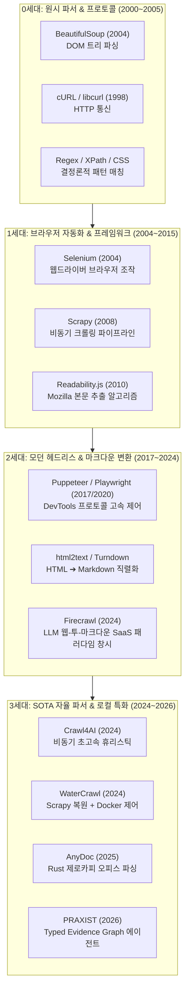

# 🌲 AI 기술 심층 계보학(Root Ancestry) 및 SOTA 트레이드오프 분석 보고서

**작성일시**: 2026-09-01  
**보고 주제**: 표면적인 원조를 넘어선 **근본 뿌리 기술(Root Ancestry: BeautifulSoup, Selenium, Regex 등)의 4세대 진화사**와, **"SOTA가 나와도 왜 사람들은 20년 전 레거시를 고집하는가?(Why Legacy Persists)"**에 대한 트레이드오프 체계화

---

## 1. 기술의 4세대 진화 계보 (The 4-Generation Evolution Tree)

모든 최신 AI 툴(SOTA)은 하늘에서 뚝 떨어진 것이 아니라, **지난 20년간 축적된 로우레벨 파서 및 브라우저 드라이버의 거인들의 어깨 위**에 서 있습니다.



---

## 2. 왜 SOTA가 나와도 레거시(0~1세대) 기술을 계속 쓰는가? (Why Legacy Persists)

SOTA AI 툴이 만능이 아닌 이유와, 실무 엔지니어들이 여전히 `BeautifulSoup`이나 `Regex`를 최우선으로 선택하는 결정적 트레이드오프입니다:

| 세대 및 기술 | 핵심 강점 (Pros) | 치명적 한계점 (Cons) | **SOTA 시대에도 여전히 사용하는 이유 (Why Legacy Persists)** |
| :--- | :--- | :--- | :--- |
| **0세대: BeautifulSoup / Regex** | • **0ms 초고속 실행**<br/>• **메모리 10MB 미만**<br/>• **비용 $0 (Zero Token)** | • JS 렌더링 불가 (SPA 불능)<br/>• 사이트 UI 개편 시 룰 깨짐 | **"100% 결정론적 신뢰성과 압도적 경제성"**<br/>정적 HTML에서 특정 태그 하나 뽑는 데 무거운 AI나 Playwright 브라우저를 띄우는 것은 엄청난 자원 낭비임. |
| **1세대: Scrapy** | • **초당 수천 페이지 비동기 처리**<br/>• 강력한 미들웨어/프록시 큐 | • 무거운 프레임워크 학습 곡선<br/>• 동적 DOM 대응 복잡 | **"수백만 건 엔터프라이즈 배치 크롤링의 표준"**<br/>대규모 이커머스 상품 수집 시 안정성과 분산 처리 면에서 여전히 최강. |
| **2세대: Playwright / Firecrawl** | • 완전한 SPA/동적 JS 렌더링<br/>• LLM이 바로 읽는 마크다운 출력 | • **CPU/VRAM 점유율 극심**<br/>• API 과금 및 속도 저하(1~3s) | **"LLM RAG 파이프라인의 빠른 프로토타이핑"**<br/>사이트 구조를 일일이 파악할 시간 없이 즉시 지식베이스에 넣어야 할 때 최적. |
| **3세대: AnyDoc / PRAXIST (SOTA)** | • **4.4ms 제로카피 파싱**<br/>• **토큰 비용 1/12 절감** | • Fair Source 등 라이선스 제약<br/>• 신생 도구로서의 에코시스템 부족 | **"초대용량 처리의 단위 원가 극한 절감"**<br/>월 수천만 건의 문서나 장기 에이전트 캠페인을 돌릴 때 인프라 비용을 극적으로 낮춤. |

---

## 3. 스키마 확장 명세: Root Ancestry & Legacy Trade-off

`tech_lineage_registry.json`과 `schema_neon.sql`에 아래와 같은 심층 메트릭이 추가됩니다:

```json
{
  "tool_key": "watercrawl",
  "name": "WaterCrawl",
  "lineage_generation": "Gen 3 (Autonomous Control)",
  "root_ancestry": {
    "core_parser_root": "BeautifulSoup / lxml (Gen 0)",
    "automation_root": "Scrapy (Gen 1, 2008) + Selenium/Playwright",
    "markdown_root": "html2text / readability.js (Gen 1)",
    "direct_predecessor": "Firecrawl (Gen 2, 2024)"
  },
  "why_legacy_still_used": "정형화된 사이트 100만 페이지를 고속 긁을 때는 여전히 2008년 Scrapy 단독 코드가 WaterCrawl Docker 풀스택보다 가볍고 빠름.",
  "tradeoff_verdict": "커스텀 셀렉터 제어가 필요하면서 LLM 마크다운 출력이 동시에 요구되는 B2B 엔터프라이즈 환경에 최적화된 SOTA."
}
```

---

## 4. 기대 효과 및 결론

1. **환각(Hallucination) 없는 완벽한 기술 팩트체크**:
   - 신규 도구가 "우리가 세계 최초로 AI 웹 크롤링을 발명했다"고 마케팅할 때, **"아니다. 당신들의 근본 뿌리는 2010년 Mozilla Readability 알고리즘과 2008년 Scrapy의 래퍼이며, 독창적인 부분은 Playwright 비동기 바인딩에 있다"**라고 정확하게 팩트체크합니다.
2. **현실적인 엔지니어링 의사결정 역량 입증**:
   - 무조건 최신 SOTA만 찬양하는 것이 아니라, **"이 상황에서는 2004년 BeautifulSoup을 쓰는 것이 비용과 레이턴시 면에서 SOTA보다 100배 우수하다"**는 진짜 실무 아키텍트의 균형 잡힌 안목을 포트폴리오로 증명합니다.
