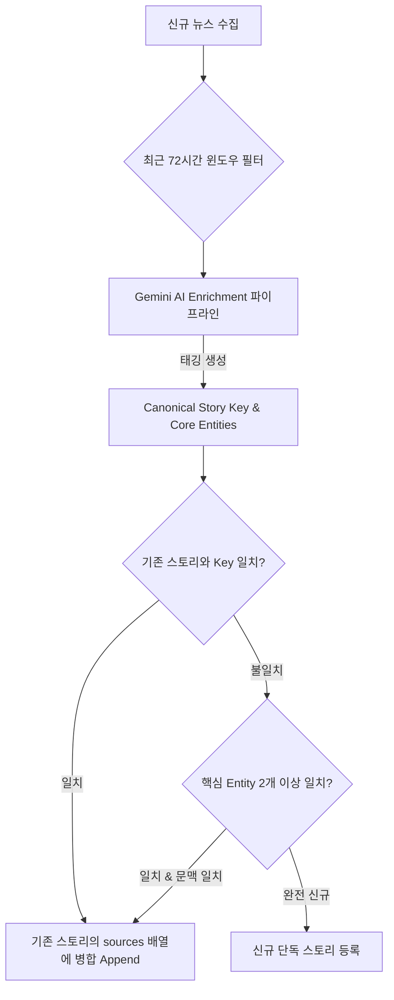

# 📊 멀티 소스 뉴스 중복 감지 및 스토리 클러스터링(Story Clustering) 전략 보고서

> **작성 일자**: 2026년 9월 6일  
> **대상 시스템**: AI 팩트체크 & 트렌드 레이더 플랫폼 (`ai-factcheck-portfolio`)  
> **핵심 과제**: 여러 출처(GeekNews, Hacker News, Wired, IT World 등)에서 표현과 언어가 다르게 유입되는 동일 사건/기술 뉴스를 감지하여, 대시보드 피로도 없이 **단일 스토리 카드 아래 다중 출처(원문 + 커뮤니티 반응)로 묶어 병합**하는 아키텍처 설계

---

## 1. 배경 및 문제 제기

### 1.1 실제 발생한 대표적 중복 사례
최근 테크 피드에서 실제로 유입된 전형적인 사례:
* **출처 A (긱뉴스 번역)**: *"플록, 교통단속 녹화한 퇴역군인 추적에 100회 이상 사용"*
* **출처 B (국내 IT 블로그)**: *"교통 단속을 촬영한 해군 퇴역군인, Flock으로 100회 넘게 추적당해"*
* **출처 C (Hacker News / 원문 Wired)**: *"Navy veteran who filmed traffic stop tracked 100+ times with Flock surveillance"*

### 1.2 왜 기존의 보편적 기법들은 실패하는가?
1. **URL 기반 중복 제거 (URL Exact Match)**
   - Wired 원문 링크, 긱뉴스 게시글 링크, Hacker News 토론 쓰레드 링크의 도메인과 쿼리 파라미터가 모두 다르므로 **100% 중복 검출 실패**.
2. **단순 문자열 유사도 (Levenshtein / Jaccard / n-gram)**
   - *"플록"* vs *"Flock"*, *"녹화한"* vs *"촬영한"*, *"100회 이상 사용"* vs *"100회 넘게 추적당해"*
   - 단어와 조사가 전혀 달라 문자열 유사도 측정 시 유사도가 40~50% 이하로 떨어져 동일 사건으로 인식하지 못함.
   - 특히 영문(Hacker News)과 한국어(긱뉴스) 간에는 문자열 유사도가 0%가 됨.
3. **순수 벡터 임베딩 유사도만 사용하는 경우의 치명적 한계 (Threshold Dilemma)**
   - 코사인 유사도 임계치를 0.82~0.85로 낮추면 위 두 기사는 묶이지만, 반대로 **"Llama-3 8B 출시"**와 **"Llama-3 70B 출시"**, 혹은 **"iOS 18.1 배포"**와 **"iOS 18.2 배포"**처럼 단어 하나만 다르고 문맥이 거의 동일한 **전혀 다른 사건들까지 오탐(False Positive)으로 합쳐지는 재앙**이 발생함.
4. **'단순 삭제(Drop)' 방식의 정보 손실**
   - 둘 중 하나를 단순 중복으로 판정하여 폐기(Drop)하면, **긱뉴스 한국어 개발자 댓글, Hacker News의 심도 있는 기술 토론, 그리고 공식 원문 기사 링크 중 하나를 유실**하게 됨.

---

## 2. 글로벌 선진 서비스 벤치마킹 (Industry Standards)

| 서비스 | 클러스터링 방식 | 사용자 경험(UX) 가치 |
| :--- | :--- | :--- |
| **Techmeme** (글로벌 1위 IT 애그리게이터) | **Discussion Tree & Multi-Source Clustered Thread**<br>핵심 기사 1개를 헤드라인으로 두고, 아래에 `[HN Discussion]`, `[X Thread]`, `[Substack Commentary]` 링크를 함께 노출 | 하나의 카드에서 **사건 개요 + 전문가/커뮤니티 반응**을 한눈에 파악할 수 있는 극상의 정보 밀도 제공 |
| **Google News** | **Full Coverage (전체 취재 기사)**<br>스토리 클러스터링을 통해 메인 기사 1개 아래 "출처 10개 더보기", 매체 다양성 노출 | 중복된 기사 도배를 방지하고 신뢰도 높은 원문과 다양한 시각의 보도를 묶음 |
| **Ground News** | **Story Blindspot & Multi-Coverage Hub**<br>동일 사건에 대해 보수/진보/기술전문지 등 복수 출처를 그룹화하여 편향도 및 팩트 지수 종합 | 사용자에게 "이 뉴스는 5개 매체에서 보도 중"이라는 검증 신뢰성 부여 |

---

## 3. 중복 처리 및 클러스터링 기법 비교 분석



### 기법 1: MinHash + LSH (Locality Sensitive Hashing)
* **원리**: 문서의 n-gram 집합을 해시화하여 자카드 유사도를 초고속 근사 계산.
* **장점**: 수만 건의 대용량 기사도 밀리초 단위로 중복 제거 가능.
* **단점**: 다국어(영문-한글) 매칭 불가, 조사나 어휘가 바뀐 패러프레이징 검출 불가.
* **평가**: 대규모 웹 크롤러에는 필수이나, RSS/API 요약 파이프라인에는 부적합.

### 기법 2: 순수 다국어 벡터 임베딩 (BGE-M3, text-embedding-3)
* **원리**: 텍스트를 고차원 벡터로 변환하여 코사인 유사도 검색.
* **장점**: 언어 간 장벽 극복(한글-영어-중국어 매칭 가능).
* **단점**: 임베딩 API 비용 및 벡터 연산 오버헤드, 숫자/버전/주체 차이에 대한 미세 분별력 부족 (오탐율 높음).

### 기법 3: LLM 2-Pass 비교 (Pairwise LLM Deduplication)
* **원리**: 중복 후보 2개를 LLM에게 주고 "둘이 같은 사건인가?" 질문.
* **장점**: 인간과 동일한 100%에 가까운 판별 정확도.
* **단점**: 기사가 N개 들어올 때 비교 횟수가 $O(N^2)$로 폭증하여 LLM 비용 및 레이턴시 감당 불가.

### 기법 4 (★ 최적의 채택안): LLM Enrichment 일체형 Canonical Story Key + Multi-Source Hub
* **원리**:
  - 이미 돌리고 있는 `enrich_inbox_with_ai.py`의 1회 LLM 호출 시, 요약/번역과 함께 **"정규화된 표준 사건 키(Canonical Story Key)"**와 **"핵심 개체 튜플(Core Entities)"**을 함께 추출.
  - 별도의 2차 LLM 호출 없이, **단 한 번의 호출로 중복 감지 지문을 확보**.
  - 최근 72시간 내의 기사들과 키를 비교하여, 동일 사건일 경우 카드를 새로 만들지 않고 **`sources` 목록에 새로운 출처를 추가(Append)**.

---

## 4. 우리 프로젝트를 위한 최종 도입 설계안

### 4.1 데이터 스키마 진화 (Data Schema)

기존의 단일 출처 구조를 손상하지 않으면서, 다중 출처를 깔끔하게 수용하는 **하위 호환(Backward Compatible) 스키마**:

```json
{
  "inbox_id": "INBOX-20260906-001",
  "title": "플록, 교통단속 녹화한 퇴역군인 추적에 100회 이상 사용",
  "title_ko": "교통단속 촬영한 해군 퇴역군인, AI 감시망(Flock)으로 100회 이상 불법 추적당해",
  "source_platform": "GeekNews",
  "source_url": "https://news.hada.io/topic?id=12345",
  "category_primary": "INFRA_RAG_SECURITY",
  "type_classification": "NEWS",
  
  "dedup_metadata": {
    "canonical_story_key": "2026-09-flock-safety-surveillance-veteran-tracking",
    "core_entities": ["Flock Safety", "Navy Veteran", "Traffic Stop ALPR"],
    "event_summary_en": "Police used Flock Safety camera network 100+ times to track a Navy veteran who filmed traffic stop."
  },
  
  "sources": [
    {
      "source_name": "긱뉴스",
      "platform": "GeekNews",
      "title": "플록, 교통단속 녹화한 퇴역군인 추적에 100회 이상 사용",
      "url": "https://news.hada.io/topic?id=12345",
      "type": "community_kr",
      "published_at": "2026-09-06T08:00:00Z"
    },
    {
      "source_name": "Hacker News",
      "platform": "HackerNews",
      "title": "Navy veteran who filmed police tracked 100+ times with Flock",
      "url": "https://news.ycombinator.com/item?id=43210",
      "type": "discussion_en",
      "published_at": "2026-09-06T09:15:00Z"
    },
    {
      "source_name": "Wired",
      "platform": "Media",
      "title": "Police Used Flock Cameras Over 100 Times to Track Veteran",
      "url": "https://www.wired.com/story/flock-safety-alpr-veteran-police/",
      "type": "original_media",
      "published_at": "2026-09-06T06:30:00Z"
    }
  ],
  "source_count": 3
}
```

### 4.2 프롬프트 개선 (`inbox_enrichment_prompt.yaml`)
기존 프롬프트의 JSON 스키마에 아래 3개 지문 필드를 추가:
```yaml
output_json_schema: |
  {
    ... (기존 번역/분류 필드 유지) ...
    "dedup_fingerprint": {
      "canonical_story_key": "사건/기술을 대표하는 영어 소문자 하이픈 슬러그 (예: flock-safety-surveillance-veteran, deepseek-v3-release)",
      "core_entities": ["핵심 주체/기업/인물 1", "핵심 기술/도구/사건 2", "핵심 키워드 3"],
      "is_breaking_news": true 또는 false
    }
  }
```

### 4.3 병합 로직 (Merge Engine) 워크플로우
1. **수집 파이프라인(`harvest_trends.py`)**:
   - 신규 기사 유입 시, 기존 인박스 DB에서 **최근 72시간(3일) 내 수집된 항목**들의 `canonical_story_key` 및 URL 해시 인덱스를 메모리에 로드.
2. **1차 매칭 (Exact Key Match)**:
   - 신규 기사의 `canonical_story_key`가 기존 항목과 정확히 일치하는 경우:
     👉 신규 카드를 생성하지 않고, 기존 카드의 `sources` 배열에 신규 출처를 추가(Append).
     👉 `source_count += 1` 갱신.
3. **2차 매칭 (Fuzzy Entity Match)**:
   - 키가 일치하지 않더라도 `core_entities` 3개 중 2개 이상이 겹치는 경우:
     👉 간단한 문자열 오버랩 검사를 거쳐 동일 사건 판정 시 병합.
4. **결과 보존**:
   - DB에 `UPDATE` 수행. (기존 마크다운/JSON에도 완벽 반영)

---

## 5. 프론트엔드 대시보드 UI/UX 혁신안

### 5.1 시각적 목업 (Visual Representation)

#### [기존 방식 - 피로도 유발]
* 🗂️ 카드 1: 플록, 교통단속 녹화한 퇴역군인 추적에 100회 이상 사용 (긱뉴스)
* 🗂️ 카드 2: 교통 단속을 촬영한 해군 퇴역군인, Flock으로 100회 넘게 추적당해 (IT뉴스)
* 🗂️ 카드 3: Navy veteran tracked 100+ times by Flock (HN)
  *(사용자 반응: "방금 본 뉴스인데 왜 또 나오지?")*

#### [개선 방식 - Techmeme 스타일의 고밀도 멀티 허브]
```text
┌────────────────────────────────────────────────────────────────────────┐
│ 🛡️ INFRA_RAG_SECURITY  •  📅 2026-09-06  •  🔥 출처 3개 묶음           │
│                                                                        │
│ 📌 교통단속 촬영한 해군 퇴역군인, AI 감시망(Flock)으로 100회 이상 사찰당해  │
│ 💡 "시민의 합법적 경찰 촬영에 대응하여 민간 AI 번호판 추적망이 100회 넘게 오남용된 사건" │
│                                                                        │
│ 🔗 출처 및 관련 커뮤니티 반응 (3):                                      │
│  [📰 원문 기사 (Wired)]  [💬 긱뉴스 토론]  [🌐 Hacker News 토론 (142)]   │
└────────────────────────────────────────────────────────────────────────┘
```

* **사용자 편익**:
  1. 중복 피드로 인한 피로도 0%
  2. 한 번의 클릭으로 **언론사 공식 팩트체크 원문**과 **국내외 개발자들의 실제 반응/댓글**을 오가며 입체적 탐색 가능
  3. "이 뉴스는 국내외 여러 채널에서 교차 검증되고 있구나"라는 신뢰도 획득

---

## 6. 단계별 도입 로드맵 (Actionable Steps)

1. **1단계: 프롬프트 및 스키마 업데이트 (비용 0원)**
   - `configs/prompts/inbox_enrichment_prompt.yaml`에 `dedup_fingerprint` 필드 추가.
2. **2단계: 병합 처리 엔진 구현 (`tools/dedup_merger.py`)**
   - 최근 72시간 윈도우 기반 `canonical_story_key` 매칭 및 `sources` 배열 추가 로직 작성.
   - 기존의 `tools/enrich_inbox_with_ai.py` 수집 파이프라인에 결합.
3. **3단계: 기존 인박스 데이터 마이그레이션**
   - 현재 인박스에 존재하는 겹치는 기사들을 스캔하여 `sources` 형태로 1회 정돈.
4. **4단계: 대시보드 UI 연동 (`dashboard/index.html`)**
   - `sources`가 2개 이상인 경우 "출처 N개 묶음" 배지와 함께 각 플랫폼별 바로가기 링크 버튼 렌더링.

---

## 7. 결론 및 제언
사용자께서 정확히 짚어주신 것처럼, 단순히 문자열 유사도로 중복을 걸러내는 방식은 **오탐(False Positive)과 미탐(False Negative)의 딜레마**에 빠질 수밖에 없습니다.

이미 파이프라인에서 작동하고 있는 **Gemini AI 모델의 의미론적 이해 능력(Semantic Understanding)**을 활용하여, 요약 시점에 **`canonical_story_key`를 1회 태깅**받고, 이를 기반으로 **여러 출처를 하나의 스토리 아래 묶어주는 Techmeme 방식**이 가장 완성도 높고 경제적이며 확장성 있는 해결책입니다.
