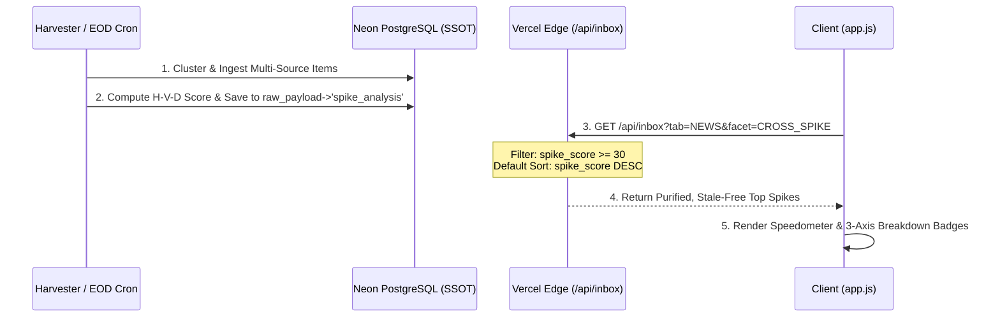

# FactCheck Hub — Cross-Viral Spike Intelligence Engine Specification (2026)

> **Document Type:** Core Architectural Specification  
> **Status:** APPROVED / IMPLEMENTATION STAGE  
> **Target Release:** v2.6.0  
> **Authors:** AI FactCheck Hub Engineering Team  

---

## 1. Executive Summary & Critical Post-Mortem

### 1.1 Background
The "🔥 Cross-Viral (Spike)" feature of FactCheck Hub was designed to surface stories that transcend single echo chambers—stories that break out across institutional newsrooms, grassroots developer forums, and open-source code repositories simultaneously.

### 1.2 The 5 Fatal Flaws in the Legacy v2.4 Engine
A comprehensive database audit of 5,172 items in production (`raw_trends_inbox`) revealed severe structural regressions:

```
Total Items Analyzed: 5,172
├── Actual Multi-Source Clusters: 89 items (1.7%)
├── Marked as is_cross_spiking = true: 7 items (0.13%)
└── Captured by `delta > 0` condition: 914 items (17.6%)  <-- 90%+ NOISE
```

1. **Superficial Multiplicity (양적 단순 합산의 오류)**:
   - The system treated 2 duplicated PR RSS feeds identically to an explosive scoop covered by 8 tier-1 outlets.
2. **The `delta > 0` Noise Catastrophe (단순 증분 노이즈)**:
   - Any article that gained +1 GitHub star or +1 HN point weeks ago remained tagged as "spiking", drowning out genuine breaking trends with 914 stale items.
3. **Absence of Time Decay (시간 감쇠 부재)**:
   - Once a cluster merged or received a spike flag, it stayed in the spike feed permanently.
4. **Platform Heterogeneity Blindness (이기종 생태계 무시)**:
   - Failed to distinguish between homogeneous coverage (3 press outlets rewriting each other) vs. heterogeneous triangulation (Press + Hacker News + GitHub).
5. **Decoupled Facet & Sort UX (정렬 부조화)**:
   - Clicking `🔥 크로스 바이럴 (급상승)` retained the default `date-audit-desc` sort, meaning a 10-outlet mega-scoop could be buried on page 3 while a minor RSS article sat at #1.

---

## 2. Mathematical Formalization: H-V-D Tripod Decay Engine

To solve these flaws from the ground up, we introduce the **H-V-D Tripod Decay** scoring model:

$$\mathbf{SpikeScore}(t) = \Big( \mathcal{H} \times \mathcal{V} \times \mathcal{D} \Big) \times \Phi(t)$$

### 2.1 Component 1: $\mathcal{H}$ — Heterogeneity Multiplier (생태계 다양성 계수)
We classify every signal source into one of three disjoint ecological axes:
- **Axis 1 (Press/Media - 제도권 저널리즘)**: Reuters, BBC, NYT, Bloomberg, The Verge, TechCrunch, Fortune, The Hill, etc.
- **Axis 2 (Discussions/Community - 개발자·시민 공론장)**: Hacker News, Reddit, GeekNews, etc.
- **Axis 3 (Artifacts/Code - 기술 실체 및 코드)**: GitHub Trending, HuggingFace Models/Spaces, ArXiv, PyTorch, etc.

$$\mathcal{H} = \begin{cases} 
1.0 & \text{if } |\text{Axes}| = 1 \text{ (Single ecosystem, e.g. Press only)} \\ 
2.5 & \text{if } |\text{Axes}| = 2 \text{ (Cross-ecosystem, e.g. Press + Community)} \\ 
5.0 & \text{if } |\text{Axes}| \ge 3 \text{ (Super-Spike: Press + Community + Code/Model)} 
\end{cases}$$

### 2.2 Component 2: $\mathcal{V}$ — Velocity & Ingestion Acceleration (확산 속도)
Let $N_{\text{sources}}$ be the total distinct verified sources, and $\Delta t_{\text{hours}}$ be the hours elapsed since the earliest scraped source:

$$\mathcal{V} = \frac{N_{\text{sources}}}{\max(1.0, \, \Delta t_{\text{hours}}^{0.6})} \times \left(1.0 + \min\left(2.5, \, \frac{\Delta \text{Metric}}{40}\right)\right)$$

- Stories that aggregate 4+ sources within 12 hours receive an exponential velocity boost.

### 2.3 Component 3: $\mathcal{D}$ — Depth of Engagement (담론의 밀도)
Rather than raw views, $\mathcal{D}$ measures active intellectual deliberation:

$$\mathcal{D} = \log_{10}\Big(10 + (\text{Comments} \times 2.0) + (\text{Upvotes} \times 0.5) + (\text{Stars} \times 0.2)\Big)$$

- Comments and discourse are weighted 4x higher than passive upvotes.

### 2.4 Component 4: $\Phi(t)$ — Exponential Half-Life Decay (시간 감쇠)
News virality exhibits an exponential decay curve. We set the half-life $T_{1/2} = 36 \text{ hours}$:

$$\lambda = \frac{\ln(2)}{36} \approx 0.01925 \text{ hr}^{-1}$$
$$\Phi(t) = e^{-\lambda \cdot t_{\text{elapsed}}}$$

- **At $t = 0 \text{h}$**: $\Phi(t) = 1.00$ (100% of score)
- **At $t = 12 \text{h}$**: $\Phi(t) \approx 0.79$ (79% of score)
- **At $t = 36 \text{h}$**: $\Phi(t) = 0.50$ (50% of score)
- **At $t = 72 \text{h}$**: $\Phi(t) = 0.25$ (25% of score)
- **At $t > 96 \text{h}$**: Item naturally drops below the Spike threshold ($\ge 30$) and smoothly rotates into standard chronological archive.

---

## 3. Tier Classification Thresholds

| Spike Tier | SpikeScore Range | Visual Badge | Icon & Style |
| :--- | :---: | :--- | :--- |
| **🔥 3-Axis SUPER SPIKE** | $\ge 250$ | `🔥 SUPER SPIKE (언론+커뮤니티+코드)` | Amber-Red Gradient + Pulse |
| **⚡ 2-Axis CROSS SPIKE** | $80 \sim 249$ | `⚡ CROSS SPIKE (언론+커뮤니티)` | Orange-Yellow Gradient |
| **📈 FAST CLIMBER** | $30 \sim 79$ | `📈 급상승 트렌드` | Slate-Indigo Subtle |
| **Normal Archive** | $< 30$ | *(None - Standard Feed)* | Standard Source Badges |

---

## 4. Pipeline Architecture & Integration



---

## 5. Implementation Roadmap
1. **Batch Scoring Tool (`tools/recompute_spike_scores.py`)**: Backfill all existing DB items.
2. **API Logic Migration (`api/inbox.js`)**: Strip out `delta > 0` condition, enforce H-V-D filtering and auto-sorting.
3. **EOD Digest Upgrade (`tools/run_eod_digest.py`)**: Embed H-V-D formula in daily 23:00 KST ranking.
4. **Frontend UI Refresh (`docs/app.js`, `public/app.js`, `src/js/app.js`)**: Display multi-axis badges and speedometers.
