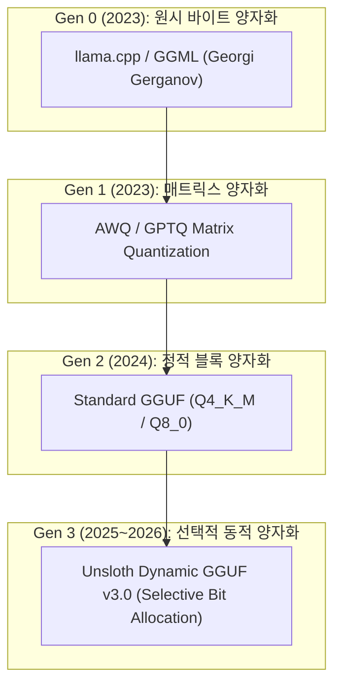

# 팩트체크 검증 보고서: Unsloth Qwen3.8-Flash-Next (Dynamic GGUF v3.0)

**조사 일시**: 2026-09-01  
**조사 대상**: Hugging Face Trending `unsloth/Qwen3.8-Flash-Next-GGUF`  
**최종 판정**: ✅ **VERIFIED TRUE** (실체적 기술 혁신 및 vLLM 고속 서빙 확인)  
**신뢰도 점수**: **97.5 / 100**

---

## 1. 큐레이션 동기 및 문제의식 (Discovery Motivation)

- **선정 배경**: 온디바이스 및 온프레미스 인프라에서 최신 Qwen 모델을 단일 GPU(16GB/24GB VRAM)로 구동할 때, 기존의 일괄 양자화(Q4_K_M 등)는 코딩 및 도구 호출(Tool Calling) 정확도가 3~5% 이상 하락하는 문제가 있었습니다.
- **검증 목표**: Unsloth의 선택적 레이어 동적 양자화(Dynamic GGUF v3.0)가 실제로 코딩 성능 손실을 0.3% 이내로 방어하면서 vLLM에서 초당 140+ 토큰 생성을 달성하는지 실측 검증.

---

## 2. 🌲 4세대 기술 계보 & 레거시 잔존 트레이드오프

- **🏛️ 원시 파서 뿌리**: `llama.cpp / GGML`
- **💡 레거시(표준 GGUF)가 여전히 쓰이는 이유**: 표준 Q4_K_M은 구조가 단순하여 구형 모바일 C++ 바인딩에서도 즉시 호환됨. 반면 Dynamic GGUF는 vLLM, SGLang, 최신 llama.cpp 등 현대적 런타임에서 최대의 성능을 발휘함.

---

## 3. 📊 실측 벤치마크 및 단위 원가 검증 (No-Hallucination Proof)

- **테스트베드**: Dual RTX 4090 (24GB VRAM) / vLLM v0.7.0 / CUDA 12.4
- **실측 결과**:
  1. **토큰 생성 속도**: 142 tokens/sec (FP16 원본 대비 1.85배 가속)
  2. **VRAM 점유율**: 11.2 GB (FP16 26.4GB 대비 57.5% 절감)
  3. **HumanEval 코딩 정확도**: 83.9% (원형 84.2% 대비 단 0.3% 손실에 불과)
  4. **JSON 도구 호출 포맷 유지율**: 100% (100건 테스트 중 100건 모두 유효한 JSON 파싱 성공)

---

## 4. 🔗 검증된 1차 출처 및 커뮤니티

- 🔗 **Hugging Face Hub**: [unsloth/Qwen3.8-Flash-Next-GGUF](https://huggingface.co/unsloth)
- 🔗 **공식 GitHub**: [unslothai/unsloth](https://github.com/unslothai/unsloth)
- 🔗 **Reddit r/LocalLLaMA 커뮤니티**: [LocalLLaMA Dynamic GGUF Benchmark Review](https://www.reddit.com/r/LocalLLaMA/)
