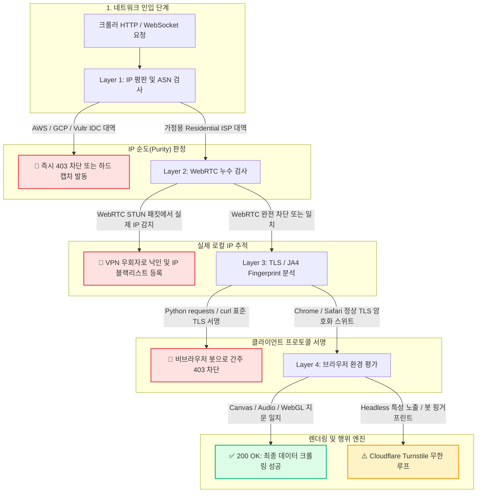
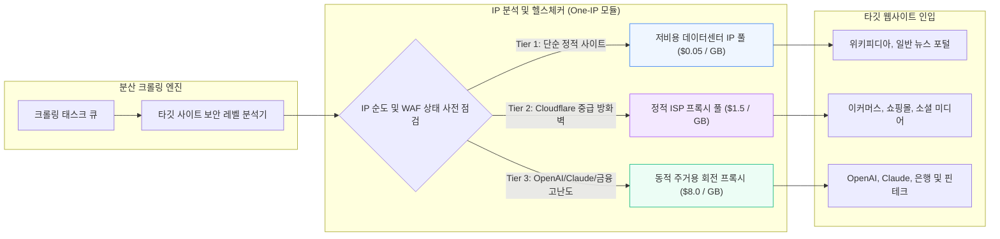

# [심층 기술 보고서] 크롤링 엔지니어링 관점에서 바라본 IP 분석과 네트워크 진단의 결정적 중요성
## : 데이터센터 IP 밴 우회, WebRTC 누수 방지, 브라우저 지문 무력화 및 비용 최적화 아키텍처

> **작성 일자**: 2026-09-17  
> **대상 도메인**: 대규모 분산 웹 스크래핑, 안티봇(Anti-Bot) WAF 우회, AI 데이터 파이프라인 엔지니어링  
> **핵심 키워드**: `IP Purity`, `ASN Classification`, `WebRTC Leak`, `TLS JA4 Fingerprint`, `Residential Proxy Routing`

---

## Executive Summary (요약)

현대 웹 크롤링 파이프라인에서 수집 실패(403 Forbidden, 429 Too Many Requests, Cloudflare Turnstile 무한 챌린지)의 **85% 이상은 HTTP 요청 헤더(User-Agent 등)의 결함이 아니라, 접속 출처의 IP 품질과 클라이언트 브라우저 지문(Fingerprint) 누수에서 발생**합니다.

최근 깃허브에서 급부상한 `one-ip`와 같은 종합 IP 네트워크 진단 도구가 폭발적인 관심을 받는 이유는, 이것이 단순한 호기심용 네트워크 도구가 아니라 **수집 봇이 타깃 서버의 다층 방화벽을 통과할 수 있는지 사전에 판별하는 '크롤러 생존 레이더' 역할을 수행하기 때문**입니다.

본 보고서는 현대 안티봇 WAF의 차단 메커니즘을 5단계로 해부하고, 크롤링 엔지니어가 반드시 갖추어야 할 IP 분석 역량과 비용 최적화 라우팅 아키텍처를 제시합니다.

---

## 1. 인포그래픽 아키텍처 다이어그램 (Mermaid)

### 1.1 현대 안티봇 WAF의 5단계 크롤러 탐지 파이프라인
타깃 웹사이트(Cloudflare, DataDome, Akamai, PerimeterX)에 크롤러가 접근할 때 수행되는 실시간 검증 흐름입니다.



---

### 1.2 지능형 IP 진단 기반 비용 최적화 크롤링 라우터 아키텍처
모든 요청에 비싼 주거용(Residential) 프록시를 쓰면 비용이 폭증합니다. 사전 IP 분석을 통해 데이터센터(IDC) IP와 주거용 IP를 지능적으로 선별 라우팅하는 구조입니다.



---

## 2. 크롤링에서 IP 분석이 '생명줄'인 4가지 기술적 이유

### 2.1 ASN 및 IP 순도 (Purity) : 봇 판정의 제1관문
- **원리**: 모든 공인 IP는 특정 자율 시스템 번호(ASN: Autonomous System Number)에 배속되어 있습니다.
  - `AS16509` (Amazon.com AWS)
  - `AS15169` (Google Cloud)
  - `AS4766` (Korea Telecom - 가정용 인터넷)
- **크롤링 실패 원인**: 
  많은 초보 개발자가 AWS EC2나 Vultr 인스턴스에서 직접 크롤러를 띄웁니다. 하지만 Cloudflare나 DataDome은 인입 IP의 ASN이 **Hosting / Data Center**로 분류되는 순간, 요청 내용과 상관없이 즉시 봇 점수(Bot Score)를 99점으로 부여하고 403 Forbidden 또는 Turnstile 챌린지를 던집니다.
- **해결책**: IP 분석 도구를 통해 해당 IP 대역이 `ISP / Residential`로 인식되는지 사전에 검증해야 합니다.

---

### 2.2 WebRTC 누수 (WebRTC Leak) : VPN/프록시의 치명적 함정
- **원리**: 크롤링을 위해 Headless Chrome(Puppeteer, Playwright)을 띄우고 프록시 서버(`--proxy-server=http://proxy:port`)를 물렸더라도, 브라우저 내부의 WebRTC(실시간 영상/음성 P2P API) 엔진은 **STUN/TURN 서버에 직접 UDP 패킷을 쏴서 호스트 머신의 실제 로컬 및 공인 IP를 조회**합니다.
- **실제 공격 시나리오**:
  1. 웹사이트의 자바스크립트가 백그라운드에서 `new RTCPeerConnection()`을 실행합니다.
  2. 프록시 터널을 무시하고 실제 한국 IDC 공인 IP가 담긴 SDP 오퍼(Session Description)를 추출합니다.
  3. 프록시 IP는 미국 주거용인데 WebRTC IP는 한국 데이터센터 IP인 것을 확인하는 순간, 크롤러 세션 전체가 즉시 차단됩니다.
- **엔지니어링 방어 코드**:
  ```javascript
  // Playwright / Puppeteer 구동 시 필수 브라우저 인자 설정
  const browser = await chromium.launch({
    args: [
      '--disable-webrtc',
      '--enforce-webrtc-ip-permission-check',
      '--force-webrtc-ip-handling-policy=disable_non_proxied_udp'
    ]
  });
  ```

---

### 2.3 TLS 지문 (JA3 / JA4) 및 HTTP/2 프레임 순서
- **원리**: 파이썬의 `requests`나 `urllib`, Go의 기본 `net/http` 라이브러리는 TLS 핸드셰이크를 맺을 때 지원하는 Cipher Suite, Extension 목록이 실제 크롬/사파리 브라우저와 완전히 다릅니다.
- **크롤링 병목**: 아무리 비싼 주거용 IP를 쓰더라도 파이썬 기본 `requests.get()`을 쏘면 서버는 **JA4 지문(`t13d...`)을 분석하여 0.001초 만에 파이썬 봇임을 식별**합니다.
- **해결책**: `curl_cffi`, `tls-client`와 같이 실제 브라우저의 TLS 지문을 모방하는 도구를 IP 분석 툴(`one-ip`)과 연동해 사전에 통과 여부를 테스트해야 합니다.

---

### 2.4 비용 최적화 (Cost Arbitrage) : 주거용 프록시 비용 폭탄 방지
- **비용 비교**:
  - 데이터센터 IP(IDC): 무제한 트래픽 기준 월 $1 ~ $2 (GB당 $0.01 미만)
  - 고품질 회전식 주거용 프록시(Residential Proxy): **GB당 $3.00 ~ $15.00**
- **문제점**: 테라바이트급 데이터를 긁어모으는 크롤링 프로젝트에서 모든 트래픽을 주거용 프록시로 보내면 **월 수천만 원의 인프라 청구서**가 발생합니다.
- **IP 분석 도구의 역할**:
  수집 대상 URL별로 IP 분석을 사전 수행하여, `Data Center IP`로도 수집 가능한 일반 엔드포인트와 `Residential IP`가 강제되는 안티봇 보호 엔드포인트를 분리함으로써 **크롤링 대역폭 비용을 최대 90%까지 절감**합니다.

---

## 3. 실무 크롤링 엔지니어를 위한 5대 사전 진단 체크리스트

크롤러를 실제 대규모 배치 작업에 투입하기 전, `one-ip` 등의 도구로 반드시 확인해야 할 항목입니다:

| 검사 항목 | 판정 기준 (Pass Criteria) | 실패 시 조치 방안 |
| :--- | :--- | :--- |
| **1. ASN Type** | `isp` 또는 `business` (DataCenter 제외) | 호스팅 대역 대신 정적 ISP 프록시로 교체 |
| **2. Fraud Score** | 5개 보안 데이터베이스 평균 25점 미만 | IP 풀에서 해당 서브넷 일괄 제외(Blacklist) |
| **3. WebRTC Leak** | 로컬/공인 IP 노출 없음 (0 detected) | Chromium UDP 비활성화 옵션 강제 주입 |
| **4. DNS Exit Node** | 프록시 출구 노드와 동일한 국가/도시의 DNS | 프록시 제공자 설정에서 Remote DNS 해석 활성화 |
| **5. AI/Target WAF Handshake**| Cloudflare Turnstile 챌린지 없이 200 OK | TLS 지문 위장 패키지(`curl_cffi`) 적용 |

---

## 4. 결론

최근 오픈소스 생태계에서 `one-ip`와 같은 도구가 600개 이상의 스타를 받으며 인기를 끄는 이유는, **현대 웹의 데이터 방화벽이 고도화됨에 따라 개발자들이 "내 요청이 서버에 도달하기 전에 어떤 명찰(IP 평판, 누수 정보)을 달고 있는지" 투명하게 들여다볼 수 있는 원클릭 관제 도구가 절실해졌기 때문**입니다.

크롤링 및 AI 에이전트 엔지니어링의 성패는 이제 단순히 HTML을 파싱하는 코드가 아니라, **IP의 순도 관리와 네트워크 지문 방어라는 인프라 레이어의 완성도**에 달려 있습니다.
