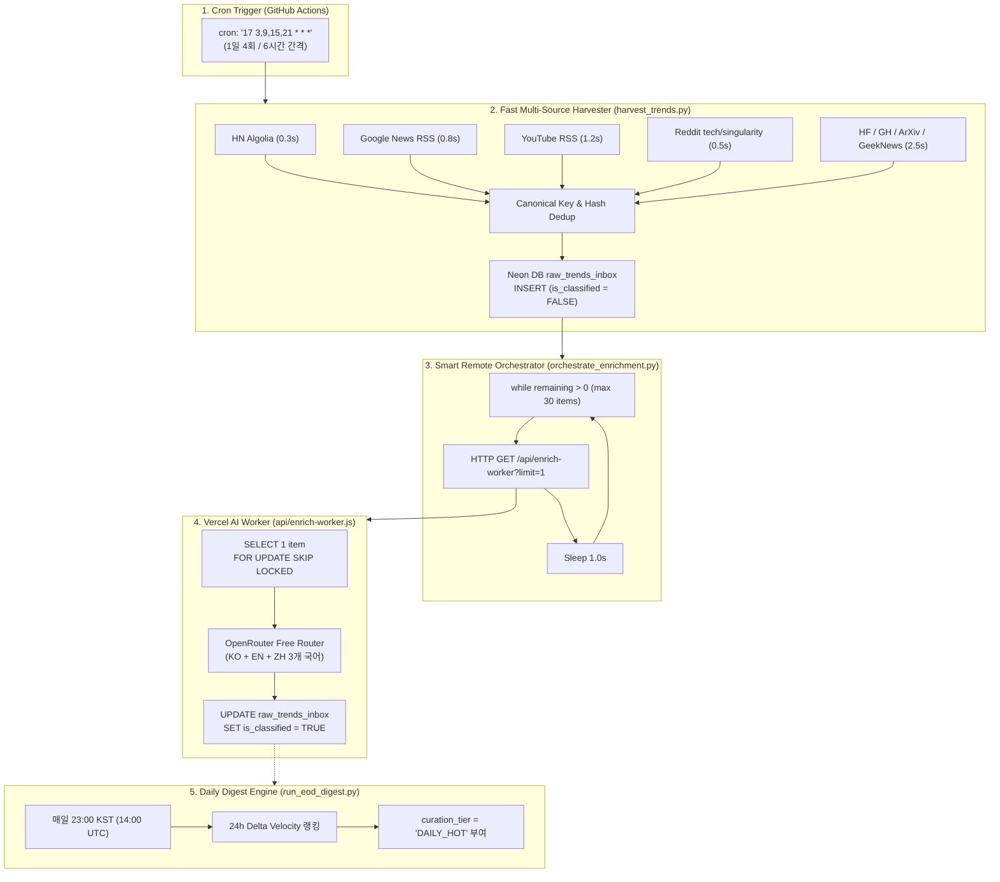

# Technical Implementation Plan: 100% Multilingual & Ultra-Lightweight Pipeline

**Feature Directory**: `specs/001-lightweight-multilingual-pipeline`  
**Created**: 2026-09-21  
**Status**: Planned & Ready for Execution  
**Governing Specification**: `specs/001-lightweight-multilingual-pipeline/spec.md`

---

## 1. Component Architecture & Data Flow



---

## 2. Detailed Component Specifications

### 2.1 Component: `api/enrich-worker.js` (Vercel Serverless AI Worker)
- **책임**: 미분류 레코드 1건을 원자적으로 가져와 OpenRouter 무료 모델을 통해 KO, EN, ZH 3개 국어 번역 및 3줄 요약, 카테고리를 추출하여 Neon DB에 커밋.
- **인터페이스 계약 (Interface Contract)**:
  - **Request**: `GET /api/enrich-worker?limit=1`
  - **Response (200 OK)**:
    ```json
    {
      "status": "success",
      "processed_count": 1,
      "model_used": "inclusionai/ling-3.0-flash-sante:free",
      "duration_seconds": 2.45,
      "remaining_unclassified": 14,
      "items": [
        {
          "inbox_id": "2026-09-21_news_deepseek-update",
          "title_ko": "딥시크 V3 업데이트 발표",
          "hook_ko": "추론 비용을 1/5로 절감한 차세대 오픈소스 모델 등장",
          "key_takeaways_ko": [
            "FP8 양자화 기반 초고속 추론 지원",
            "기존 모델 대비 메모리 사용량 40% 절감",
            "글로벌 벤치마크 점수 상위권 탈환"
          ],
          "title_en": "DeepSeek V3 Update Announced",
          "title_zh": "深度求索发布V3更新",
          "tier1_category": "TECH_COMPUTING",
          "category_primary": "INFERENCE_OPT",
          "item_type": "MODEL"
        }
      ]
    }
    ```

### 2.2 Component: `tools/harvest_trends.py` (Fast Multi-Source Harvester)
- **책임**: 8개 채널의 원시 데이터를 10초 이내에 수집하여 중복 검증 후 Neon DB에 벌크 INSERT.
- **개선 사항**:
  - `hacker_news`: Algolia API(`hn.algolia.com/api/v1/search?tags=front_page&hitsPerPage=50`)로 대체.
  - `google_news`: `news.google.com/rss/search?q=인공지능+OR+생성형AI&hl=ko&gl=KR` 및 글로벌 RSS 파싱.
  - `youtube_tech`: 주요 크리에이터(조코딩, 슈카월드, Fireship 등) RSS 피드 파싱.
  - `reddit`: `r/technology`, `r/singularity` 추가.

### 2.3 Component: `tools/orchestrate_enrichment.py` (Actions Orchestrator)
- **책임**: 수집 완료 후 Vercel 엔드포인트를 순회 호출하여 새로 유입된 모든 아이템을 100% 다국어 요약 완료.
- **주요 로직**:
  ```python
  def run_orchestration(base_url, max_items=30, delay_sec=1.0):
      # Loops while remaining_unclassified > 0
      # Break immediately when remaining == 0
      # Safe fallback on HTTP errors
  ```

### 2.4 Component: `tools/run_eod_digest.py` (23:00 KST EOD Digest Engine)
- **책임**: 최근 24시간 `trend_metric_snapshots`의 $\Delta$값과 크로스 플랫폼 동시 출현 횟수를 계산하여 상위 10개 항목에 `DAILY_HOT` 태그 부여.

---

## 3. Verification Plan

1. **단위 테스트**:
   - Algolia HN 파서 실행 $\rightarrow$ 0.5초 이내 50개 파싱 완료 검증.
   - 구글 뉴스 / 유튜브 RSS 파서 실행 $\rightarrow$ 오류 없이 30개 파싱 완료 검증.
2. **E2E 통합 테스트**:
   - `python tools/orchestrate_enrichment.py` 로컬 실행 시 Vercel API 1건 호출 및 DB 반영 검증.
   - DB에 `is_classified = TRUE` 및 `title_ko`, `title_en`, `title_zh`, `key_takeaways_ko` 3개 배열 저장 확인.
3. **CI/CD 시뮬레이션**:
   - Actions 워크플로 구문 검사 및 불필요한 배포 단계 제거 확인.
