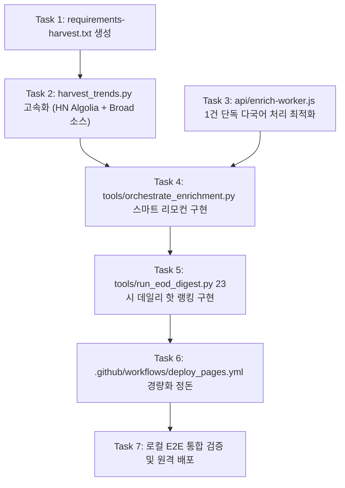

# Task Breakdown: 100% Multilingual & Ultra-Lightweight Pipeline

**Feature Directory**: `specs/001-lightweight-multilingual-pipeline`  
**Created**: 2026-09-21  
**Status**: Ready for Implementation  
**Governing Plan**: `specs/001-lightweight-multilingual-pipeline/plan.md`

---

## Task Overview & Dependencies

---

## Detailed Tasks

### [x] Task 1: Create Lightweight CI/CD Dependencies File
- **File**: `requirements-harvest.txt`
- **Action**: `psycopg2-binary>=2.9.9` 단일 의존성 파일 생성.
- **Criteria**: CI 실행 시 패키지 설치 시간 1초 미만으로 단축.

---

### [x] Task 2: Optimize Harvester with HN Algolia & Broad Sources
- **File**: `tools/harvest_trends.py`
- **Action**:
  1. Hacker News API를 60회 순차 호출에서 `hn.algolia.com/api/v1/search?tags=front_page&hitsPerPage=50` 단일 호출(0.3초)로 전환.
  2. Google News RSS (한국어/글로벌 테크), YouTube 주요 테크 채널 RSS, Reddit `r/technology`, `r/singularity` 수집기 추가.
  3. Canonical Key 기반 크로스 플랫폼 정규화 보장.
- **Criteria**: 전체 소스 수집 소요 시간 $\le$ 10초, 신규 아이템이 Neon DB에 `is_classified = FALSE`로 정상 저장됨.

---

### [x] Task 3: Enforce Single-Item Multilingual AI Worker
- **File**: `api/enrich-worker.js`
- **Action**:
  1. 기본 처리 단위를 `limit = 1`로 확정하고 단일 행 락(`FOR UPDATE SKIP LOCKED`) 보장.
  2. KO, EN, ZH 3개 국어 제목, 훅, 3줄 핵심 요약, 엔티티, 카테고리 태깅 반환 검증.
  3. 응답에 `remaining_unclassified` 정확히 카운트하여 반환.
- **Criteria**: 단일 호출 실행 시간 $\le$ 3.5초 (10초 타임아웃 발생률 0%), KO/EN/ZH 필드가 DB에 원자적으로 커밋됨.

---

### [x] Task 4: Implement Smart Orchestrator Script
- **File**: `tools/orchestrate_enrichment.py`
- **Action**:
  1. 파이썬 표준 라이브러리(`urllib.request`)로 Vercel `/api/enrich-worker?limit=1`을 순회 호출하는 오케스트레이터 작성.
  2. `remaining_unclassified == 0` 시 즉시 루프 종료.
  3. 1회당 1초 대기 (Rate Limit 보호), 최대 30회 상한선 설정.
- **Criteria**: 신규 수집된 모든 미분류 아이템이 100% 다국어 요약 완료될 때까지 크래시 없이 자동 완주.

---

### [x] Task 5: Implement 23:00 KST Daily Digest Engine
- **File**: `tools/run_eod_digest.py`
- **Action**:
  1. 최근 24시간 동안의 지표 증가량($\Delta$stars, $\Delta$likes, $\Delta$upvotes) 및 2개 이상 플랫폼 동시 출현 가중치(1.5x) 연산.
  2. 상위 10개 항목에 `curation_tier = 'DAILY_HOT'` 부여.
- **Criteria**: 2초 내에 Top 10 선정 및 DB 업데이트 완료.

---

### [x] Task 6: Streamline GitHub Actions Workflow
- **File**: `.github/workflows/deploy_pages.yml`
- **Action**:
  1. 6시간 크론 수집에서 `requirements-harvest.txt` 사용.
  2. `harvest_trends.py` $\rightarrow$ `orchestrate_enrichment.py` $\rightarrow$ `run_eod_digest.py` 순서로 파이프라인 정돈.
  3. 불필요한 Pages 정적 빌드 및 배포 단계 제거.
- **Criteria**: 워크플로 전체 런타임이 50초 이내로 단축.

---

### [x] Task 7: Full E2E Verification & Deployment
- **Action**:
  1. 로컬 환경에서 Harvester $\rightarrow$ Orchestrator $\rightarrow$ EOD Digest 연속 실행 검증.
  2. Git commit & push 후 Vercel 에지 CDN 서빙 및 GitHub Actions 실행 시간 확인.
- **Criteria**: 모든 신규 아이템에 3개 국어(KO+EN+ZH) 3줄 요약 부착, 프론트엔드 0ms 렌더링 확인.
